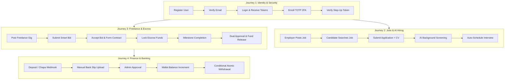

# Beleqet Ecosystem: Comprehensive End-to-End (E2E) Testing Master Guide

> [!IMPORTANT]
> This master document outlines the complete End-to-End (E2E) test specification for the entire Beleqet platform. It simulates real-world user workflows across all 60 domain modules, validating interactions between the database (PostgreSQL), cache (Redis), message queues (BullMQ), AI inference engines, third-party payment gateways, and WebSocket servers.

---

## 1. Environment Setup & Prerequisites

Before executing E2E tests, ensure your local or staging environment has all required infrastructure services running:

```bash
# 1. Verify dependencies are running (Postgres & Redis)
docker-compose up -d postgres redis

# 2. Run Prisma migrations and seed base system data
npx prisma migrate deploy
npm run prisma:seed

# 3. Start the backend service in test/dev mode
npm run start:dev
```

### Base URL & Common Headers
* **REST API Root**: `http://localhost:4000/api/v1`
* **GraphQL Endpoint**: `http://localhost:4000/graphql`
* **WebSocket Gateway**: `ws://localhost:4000/chat`
* **Default Headers**:
  ```http
  Content-Type: application/json
  Accept: application/json
  ```

---

## 2. E2E User Journey Map



---

## 3. Journey 1: Identity, Auth & 2FA Lifecycle

### Step 1.1: Register Employer and Freelancer
```bash
# 1. Register Employer
curl -X POST http://localhost:4000/api/v1/auth/register \
  -H "Content-Type: application/json" \
  -d '{
    "email": "employer.test@beleqet.com",
    "password": "Password123!",
    "firstName": "Abebe",
    "lastName": "Kebede",
    "role": "EMPLOYER"
  }'

# 2. Register Freelancer
curl -X POST http://localhost:4000/api/v1/auth/register \
  -H "Content-Type: application/json" \
  -d '{
    "email": "freelancer.test@beleqet.com",
    "password": "Password123!",
    "firstName": "Almaz",
    "lastName": "Tadesse",
    "role": "FREELANCER"
  }'
```
* **Expected Status**: `201 Created`
* **Assertions**: Response body returns `{ id, email, role, accessToken, refreshToken }`.

### Step 1.2: Login and Token Refresh
```bash
# Login
curl -X POST http://localhost:4000/api/v1/auth/login \
  -H "Content-Type: application/json" \
  -d '{
    "email": "employer.test@beleqet.com",
    "password": "Password123!"
  }'
```
* **Expected Status**: `200 OK`
* **Capture**: Store `accessToken` as `$EMPLOYER_TOKEN` and `refreshToken` as `$REFRESH_TOKEN`.

```bash
# Test Refresh Token Rotation
curl -X POST http://localhost:4000/api/v1/auth/refresh \
  -H "Content-Type: application/json" \
  -d '{
    "refreshToken": "'"$REFRESH_TOKEN"'"
  }'
```
* **Expected Status**: `200 OK`
* **Assertions**: Old refresh token is invalidated; returns new pair.

### Step 1.3: TOTP Two-Factor Enrollment & Step-Up
```bash
# 1. Initiate 2FA Enrollment
curl -X POST http://localhost:4000/api/v1/auth/2fa/enroll \
  -H "Authorization: Bearer $EMPLOYER_TOKEN"
```
* **Expected Status**: `201 Created`
* **Assertions**: Returns `{ qrCodeUrl, enrollmentToken, manualEntryKey }`.

```bash
# 2. Confirm Enrollment with TOTP Code (e.g. 123456)
curl -X POST http://localhost:4000/api/v1/auth/2fa/confirm-enrollment \
  -H "Authorization: Bearer $EMPLOYER_TOKEN" \
  -H "Content-Type: application/json" \
  -d '{
    "enrollmentToken": "<ENROLLMENT_TOKEN>",
    "code": "123456"
  }'
```
* **Expected Status**: `200 OK`
* **Assertions**: Returns array of 10 hashed backup codes.

---

## 4. Journey 2: Marketplace, AI Screening & Interview Workflow

### Step 2.1: Employer Posts a Job Listing
```bash
curl -X POST http://localhost:4000/api/v1/jobs \
  -H "Authorization: Bearer $EMPLOYER_TOKEN" \
  -H "Content-Type: application/json" \
  -d '{
    "title": "Senior Full-Stack TypeScript Engineer",
    "description": "Looking for an experienced NestJS & Next.js developer with PostgreSQL expertise.",
    "category": "Software Engineering",
    "skills": ["TypeScript", "NestJS", "PostgreSQL", "Next.js"],
    "budgetMin": 50000,
    "budgetMax": 90000,
    "currency": "ETB",
    "employmentType": "FULL_TIME",
    "location": "Addis Ababa / Remote"
  }'
```
* **Expected Status**: `201 Created`
* **Capture**: Store `job.id` as `$JOB_ID`.

### Step 2.2: Candidate Searches and Filters Jobs
```bash
curl -X GET "http://localhost:4000/api/v1/jobs?q=TypeScript&category=Software+Engineering&page=1&limit=10"
```
* **Expected Status**: `200 OK`
* **Assertions**: Result contains `$JOB_ID`, total items >= 1.

### Step 2.3: Candidate Submits Job Application
```bash
curl -X POST http://localhost:4000/api/v1/applications \
  -H "Authorization: Bearer $FREELANCER_TOKEN" \
  -H "Content-Type: application/json" \
  -d '{
    "jobId": "'"$JOB_ID"'",
    "coverLetter": "I have 5 years building production NestJS and Next.js applications.",
    "resumeUrl": "https://storage.beleqet.com/resumes/almaz-cv.pdf",
    "expectedSalary": 75000,
    "screeningAnswers": {
      "yearsExperience": 5,
      "noticePeriod": "Immediate"
    }
  }'
```
* **Expected Status**: `201 Created`
* **Capture**: Store `application.id` as `$APPLICATION_ID`.
* **Async Invariant**: BullMQ `application-processing` queue receives `screen-candidate` job.

### Step 2.4: Candidate Video Interview Session
```bash
# 1. Employer creates video interview session
curl -X POST http://localhost:4000/api/v1/video-interviews \
  -H "Authorization: Bearer $EMPLOYER_TOKEN" \
  -H "Content-Type: application/json" \
  -d '{
    "applicationId": "'"$APPLICATION_ID"'",
    "title": "Technical Round 1",
    "questions": [
      {"id": "q1", "text": "Explain how you handle concurrency in PostgreSQL."},
      {"id": "q2", "text": "Describe your experience with BullMQ job queues."}
    ]
  }'
```
* **Expected Status**: `201 Created`
* **Capture**: Store `id` as `$INTERVIEW_ID`.

```bash
# 2. Candidate submits recorded response
curl -X POST "http://localhost:4000/api/v1/video-interviews/$INTERVIEW_ID/responses" \
  -H "Authorization: Bearer $FREELANCER_TOKEN" \
  -H "Content-Type: application/json" \
  -d '{
    "questionId": "q1",
    "videoUrl": "https://storage.beleqet.com/interviews/response-q1.mp4",
    "durationSeconds": 92
  }'
```
* **Expected Status**: `201 Created`
* **Async Invariant**: Triggers FFmpeg audio extraction & Whisper transcription worker.

---

## 5. Journey 3: Freelance, Smart Bidding & Escrow Lifecycle

### Step 3.1: Create Freelance Gig
```bash
curl -X POST http://localhost:4000/api/v1/freelance/jobs \
  -H "Authorization: Bearer $EMPLOYER_TOKEN" \
  -H "Content-Type: application/json" \
  -d '{
    "title": "Build Fintech Payment Gateway Integration",
    "description": "Integrate Chapa and Stripe into an existing NestJS backend.",
    "category": "Backend Development",
    "budgetMin": 30000,
    "budgetMax": 45000,
    "currency": "ETB"
  }'
```
* **Expected Status**: `201 Created`
* **Capture**: Store `id` as `$GIG_ID`.

### Step 3.2: Freelancer Requests AI Smart Bid Prediction
```bash
curl -X GET "http://localhost:4000/api/v1/smart-bidding/predict/$GIG_ID" \
  -H "Authorization: Bearer $FREELANCER_TOKEN"
```
* **Expected Status**: `200 OK`
* **Assertions**: Returns `{ recommendedBid: 38000, confidence: 0.88, marketRateMedian: 37500 }`.

### Step 3.3: Submit Bid
```bash
curl -X POST "http://localhost:4000/api/v1/freelance/jobs/$GIG_ID/bids" \
  -H "Authorization: Bearer $FREELANCER_TOKEN" \
  -H "Content-Type: application/json" \
  -d '{
    "amount": 38000,
    "deliveryDays": 14,
    "coverLetter": "I have already integrated Chapa and Stripe in multiple projects."
  }'
```
* **Expected Status**: `201 Created`
* **Capture**: Store `id` as `$BID_ID`.

### Step 3.4: Employer Accepts Bid & Binds Contract
```bash
curl -X PATCH "http://localhost:4000/api/v1/freelance/bids/$BID_ID/accept" \
  -H "Authorization: Bearer $EMPLOYER_TOKEN"
```
* **Expected Status**: `200 OK`
* **Capture**: Store contract id as `$CONTRACT_ID`.

### Step 3.5: Fund Escrow & Lock Funds
```bash
curl -X POST http://localhost:4000/api/v1/escrow/initiate \
  -H "Authorization: Bearer $EMPLOYER_TOKEN" \
  -H "Content-Type: application/json" \
  -d '{
    "freelanceJobId": "'"$GIG_ID"'"
  }'
```
* **Expected Status**: `201 Created`
* **Assertions**: Returns `{ escrowId, status: "FUNDED", grossAmount: 38000, platformFee: 3800, netAmount: 34200 }`.
* **Ledger Invariant**: Employer wallet `lockedBalance` increments by 38000 ETB.

### Step 3.6: Milestone Completion & Dual-Confirmation Release
```bash
# 1. Employer Confirms Milestone Completion
curl -X POST "http://localhost:4000/api/v1/escrow/confirm-milestone" \
  -H "Authorization: Bearer $EMPLOYER_TOKEN" \
  -H "Content-Type: application/json" \
  -d '{
    "escrowId": "<ESCROW_ID>",
    "action": "APPROVE"
  }'

# 2. Release Escrow Funds to Freelancer
curl -X POST "http://localhost:4000/api/v1/escrow/release/<ESCROW_ID>" \
  -H "Authorization: Bearer $EMPLOYER_TOKEN"
```
* **Expected Status**: `200 OK`
* **Ledger Invariant**: 
  - Employer `lockedBalance` drops by 38,000 ETB.
  - Freelancer `availableBalance` increases by 34,200 ETB (Net 90%).
  - Platform revenue account credits 3,800 ETB (10% fee).

---

## 6. Journey 4: Payments, Manual Slips & Atomic Withdrawals

### Step 4.1: Manual Bank Wire Receipt Upload
```bash
curl -X POST http://localhost:4000/api/v1/manual-payment/submit-receipt \
  -H "Authorization: Bearer $EMPLOYER_TOKEN" \
  -F "receipt=@test-bank-slip.jpg" \
  -F "amount=50000" \
  -F "currency=ETB" \
  -F "referenceNumber=CBE-TX-9988214"
```
* **Expected Status**: `201 Created`
* **Capture**: Store `id` as `$MANUAL_PAY_ID`.

### Step 4.2: Admin Approves Deposit
```bash
curl -X PATCH "http://localhost:4000/api/v1/manual-payment/$MANUAL_PAY_ID/approve" \
  -H "Authorization: Bearer $ADMIN_TOKEN"
```
* **Expected Status**: `200 OK`
* **Ledger Invariant**: Employer wallet `balance` increments by 50,000 ETB.

### Step 4.3: Freelancer Atomic Concurrency Withdrawal
```bash
curl -X POST http://localhost:4000/api/v1/wallet/withdraw \
  -H "Authorization: Bearer $FREELANCER_TOKEN" \
  -H "Content-Type: application/json" \
  -d '{
    "amount": 20000,
    "currency": "ETB",
    "method": "TELEBIRR",
    "accountRef": "+251911223344"
  }'
```
* **Expected Status**: `200 OK`
* **Concurrency Test**: Firing two simultaneous identical withdrawal requests must return `200 OK` for one and `400 Bad Request (Insufficient available balance)` for the other, proving zero double-spend vulnerability.

---

## 7. Journey 5: AI Pipelines & Real-Time Chat

### Step 5.1: CV Upload & Structured AI Parsing
```bash
curl -X POST http://localhost:4000/api/v1/resumes/upload \
  -H "Authorization: Bearer $FREELANCER_TOKEN" \
  -F "file=@sample-cv.pdf" \
  -F "consent=true"
```
* **Expected Status**: `201 Created`
* **Assertions**: Returns extracted JSON `{ skills: [...], experienceYears: number, education: [...] }`.

### Step 5.2: Real-time Socket.io Chat Room Authorization
Connect client over WebSocket to `http://localhost:4000/chat`:
```javascript
import { io } from 'socket.io-client';

const socket = io('http://localhost:4000/chat', {
  auth: { token: 'Bearer ' + FREELANCER_TOKEN },
});

// Join room
socket.emit('join_room', { roomId: 'room-123' });

// Listen for message
socket.on('new_message', (msg) => {
  console.log('Received E2E message:', msg);
});

// Send message
socket.emit('send_message', {
  roomId: 'room-123',
  content: 'Hello, let us discuss the project milestones.',
});
```
* **Security Assertion**: Connecting with an invalid JWT or attempting to join a room without participant authorization immediately emits an `error` event and disconnects the client.

### Step 5.3: FAQ Bot Streaming via Server-Sent Events (SSE)
```bash
curl -N -H "Accept: text/event-stream" \
  "http://localhost:4000/api/v1/faq-bot/sessions/session-1/stream?message=How+does+escrow+work"
```
* **Expected Status**: `200 OK` (chunked streaming response with event data tokens).

---

## 8. Journey 6: Administrative Governance & Dispute Resolution

### Step 6.1: Contract Dispute Arbitration
```bash
# 1. Freelancer creates dispute on contract
curl -X POST http://localhost:4000/api/v1/dispute \
  -H "Authorization: Bearer $FREELANCER_TOKEN" \
  -H "Content-Type: application/json" \
  -d '{
    "contractId": "'"$CONTRACT_ID"'",
    "reason": "Milestone delivered but client unresponsive for 10 days",
    "requestedAmount": 38000
  }'
```
* **Expected Status**: `201 Created`
* **Capture**: Store `dispute.id` as `$DISPUTE_ID`.

```bash
# 2. Admin Resolves Dispute (Split 80/20)
curl -X PATCH "http://localhost:4000/api/v1/dispute/$DISPUTE_ID/resolve" \
  -H "Authorization: Bearer $ADMIN_TOKEN" \
  -H "Content-Type: application/json" \
  -d '{
    "resolution": "SPLIT",
    "freelancerAmount": 30400,
    "employerRefundAmount": 7600,
    "notes": "Work completed partially; split settlement approved."
  }'
```
* **Expected Status**: `200 OK`
* **Assertions**: Escrow is unlocked and distributed according to arbitration verdict.

### Step 6.2: Admin Stats & CSV Streaming Export
```bash
curl -X GET "http://localhost:4000/api/v1/admin-stats/overview" \
  -H "Authorization: Bearer $ADMIN_TOKEN"
```
* **Expected Status**: `200 OK`
* **Assertions**: Returns platform GMV, total user count, active jobs count.

---

## 9. Automated E2E Execution Command

To execute all automated Supertest E2E suites:

```bash
# Run all E2E test suites with Jest
npm run test:e2e

# Run single targeted E2E suite
npx jest test/health.e2e-spec.ts --config test/jest-e2e.json
npx jest test/ai-feed.e2e-spec.ts --config test/jest-e2e.json
npx jest test/user-preferences.e2e-spec.ts --config test/jest-e2e.json
```

---

## 10. E2E Pass/Fail Checklist

| Journey | Step / Module | Test Command / Endpoint | Expected Invariant | Status |
| :--- | :--- | :--- | :--- | :--- |
| **J1: Identity** | `auth` + `2fa` | `POST /auth/register` & `/login` | Password hashed with bcrypt 12; TOTP secret encrypted AES-256 | `[ ]` |
| **J1: Identity** | `rbac` | `GET /rbac/roles` | Redis permission cache invalidation on role update | `[ ]` |
| **J2: Jobs** | `jobs` | `POST /jobs` & `GET /jobs` | Validated DTO, indexed categories, pagination | `[ ]` |
| **J2: Jobs** | `applications` | `POST /applications` | Composite unique constraint blocks duplicate submissions | `[ ]` |
| **J2: Jobs** | `screening` | BullMQ worker | AI evaluates candidate & auto-invites if score >= threshold | `[ ]` |
| **J3: Escrow** | `freelance` | `POST /bids/:id/accept` | Binds contract and triggers escrow deposit | `[ ]` |
| **J3: Escrow** | `escrow` | `POST /escrow/release/:id` | Dual-confirmation required; 10% fee deducted to platform | `[ ]` |
| **J4: Finance** | `wallet` | `POST /wallet/withdraw` | Atomic conditional decrement prevents double-spending | `[ ]` |
| **J4: Finance** | `chapa` | Webhook verification | Server-to-server transaction status check before credit | `[ ]` |
| **J5: AI/Media** | `resume-brain` | `POST /resumes/upload` | PDF parsed into structured JSON with skills extraction | `[ ]` |
| **J5: AI/Media** | `chat` | Socket.io `/chat` | Room authorization checked before socket joins room | `[ ]` |
| **J6: Admin** | `dispute-manager` | `PATCH /dispute/:id/resolve` | Escrow unlocked according to arbitration terms | `[ ]` |
| **J6: Admin** | `audit-logging` | `GET /admin/audit-logs/export` | CSV/JSON export with PII redactor enabled | `[ ]` |
