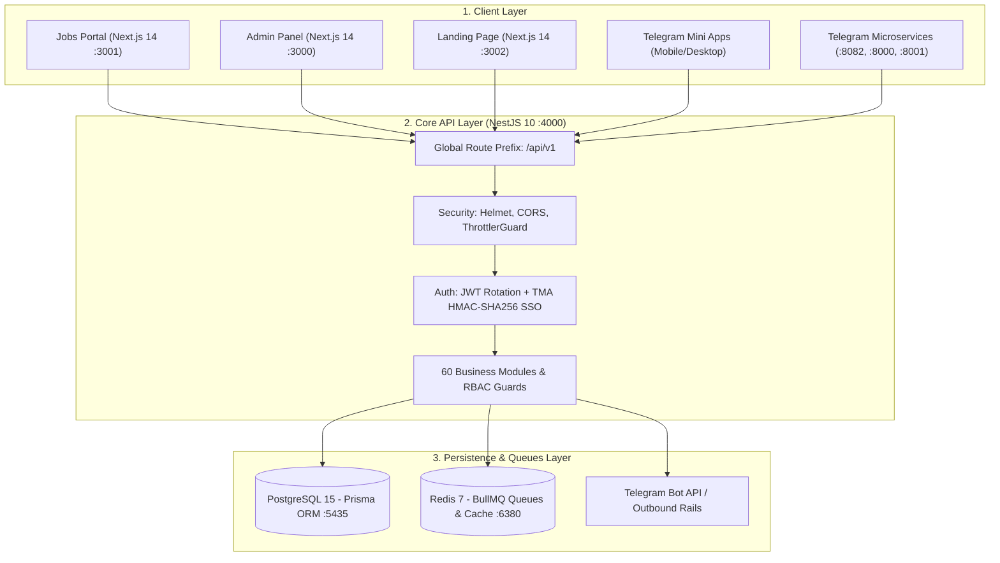

# Beleqet Ecosystem: Handover Video 1 — Architecture & Setup Deep Dive
## (የሲስተም አርክቴክቸር፣ ዳታቤዝ እና የሰርቨር መዋቅር የተግባር መመሪያ ስክሪፕት)

**Audience:** Core Engineering, Incoming Developers, Technical Leadership  
**Topic:** Video 1 — Monorepo Architecture, Data Models, Environment Rails, and Infrastructure  
**Estimated Duration:** ~12 – 15 Minutes  
**Format:** Screen Recording + Voice Narration (Amharic & English Included for Every Scene)  

---

## 📋 Pre-Recording Setup Checklist (ከመቅረጽህ በፊት አዘጋጅ)

1. **VS Code:**
   * Open `beleqet-ecosystem-updated` workspace.
   * Expand root folders in the sidebar explorer.
   * Have these files ready in tabs:
     * `src/main.ts`
     * `.env.example`
     * `prisma/schema.prisma`
     * `src/modules/telegram/telegram-tma.service.ts`
     * `docker-compose.yml`
2. **Terminal Tab 1 (Local):**
   * Ready in project root to run: `npx prisma studio`
3. **Terminal Tab 2 (VPS SSH):**
   * Connected to staging host: `ahmed@BeleqetEcosystem:/srv/beleqet-staging`
4. **Browser:**
   * Ready at `http://localhost:5555` for Prisma Studio.

---

## 📐 System Architecture Diagram (የሲስተሙ አጠቃላይ ንድፍ)



---

# 🎬 SCENE-BY-SCENE PRODUCTION SCRIPT

---

### SCENE 1: Monorepo Topology & Project Organization (00:00 – 03:00)

* **Screen Action:** Open VS Code. Show the sidebar with all root folders collapsed, then expand them one by one as you speak. Open `src/main.ts`.

#### 🎙️ Narration (አማርኛ):
> "ሰላም፣ እንኳን ወደ በለቀት ኢኮሲስተም (Beleqet Ecosystem) የቴክኒክ ማስረከቢያ ቪዲዮ በደህና መጣችሁ። የዚህ የመጀመሪያ ቪዲዮ አላማ አዲስ የሚመጣ ማንኛውም ሶፍትዌር ኢንጂነር የሲስተሙን አጠቃላይ አርክቴክቸር፣ የሞኖሪፖ አወቃቀር፣ የዳታቤዝ ግንኙነቶች እና የሰርቨር ማሰማሪያ (Deployment) መዋቅር በጥልቀት እንዲረዳ ነው።
> 
> ሲስተማችን የተገነባው በተዋሃደ ሞኖሪፖ (Monorepo) አወቃቀር ነው። ለምን ሞኖሪፖ መረጥን ካልን፡ የተለያዩ 5 ሪፖዎችን በተናጠል ከማስተዳደር ይልቅ፣ የዳታቤዝ ሞዴሎችን፣ የቲሲፒ ቦቶችን እና ፍሮንትኤንዶችን በአንድ ላይ በማስተሳሰር የአይነቶች (Types) እና የኮንትራቶች አለመጣጣም እንዳይፈጠር ያደርጋል።
> 
> ዋና ዋናዎቹ ክፍሎች የሚከተሉት ናቸው፡
> 1. `src/` — የ NestJS 10 Enterprise Core Backend API ነው። 60 የሚሆኑ ገለልተኛ የቢዝነስ ሞጁሎችን የያዘ ሲሆን፣ እያንዳንዱ ሞጁል የራሱ የሆነ Controller፣ Service፣ እና DTOs አሉት። አሁን `src/main.ts` ላይ እንደምታዩት፣ ሁሉም የኤፒአይ ጥሪዎች የሚጀምሩት በ `/api/v1` ግሎባል ፕሪፊክስ ሲሆን፣ የደህንነት መከላከያዎች እንደ Helmet፣ CORS፣ እና Rate Limiting እዚህ ተዋቅረዋል።
> 2. `beleqet-jobs-nextjs/` — ዋናው የስራ ፈላጊዎች እና የቀጣሪዎች ፖርታል (Next.js 14 App Router) ነው። ዌብሳይት ላይ ብቻ ሳይሆን በቴሌግራም ሚኒ አፕ (Mini App) ውስጥም ያለችግር ይሰራል፤ የቋንቋ መቀየሪያ (English እና አማርኛ) የተሟላለት ነው።
> 3. `frontend/` — የአድሚን አስተዳደር ዳሽቦርድ ነው። የፕላትፎርሙን አጠቃላይ ገቢ፣ ተጠቃሚዎች፣ ስራዎች እና የባንክ ክፍያዎችን ለማረጋገጥ ያገለግላል።
> 4. `frontend-main/` — ዋናው የድረ-ገጽ ማስተዋወቂያ ገጽ (Landing Page) ነው።
> 5. `bots/` — 3ቱ የቴሌግራም ማይክሮሰርቪስ ቦቶች ናቸው፤ በ Python FastAPI እና aiohttp የተገነቡ ናቸው።"

#### 🎙️ Narration (English):
> "Welcome to the Beleqet Ecosystem Technical Handover Series. In this first video, we will walk through the entire architectural topology, monorepo structure, database models, environment rails, and production infrastructure.
> 
> Our system is engineered as a unified monorepo. We chose a monorepo architecture to guarantee type-safety, eliminate API schema drift, and keep our Telegram bot microservices synchronized with the database schema and Next.js frontends.
> 
> Here is how the project is organized:
> 1. `src/` — Our enterprise NestJS 10 Core Backend API. It houses 60 modular domains, each containing its own controllers, services, and validation DTOs. As you see here in `src/main.ts`, all endpoints are globally prefixed under `/api/v1`, protected by Helmet headers, CORS policies, and rate-limiting throttlers.
> 2. `beleqet-jobs-nextjs/` — The primary jobs portal powered by Next.js 14 App Router. It serves candidates and employers on the open web and runs embedded inside the Telegram Mini App, complete with English and Amharic i18n support.
> 3. `frontend/` — The dedicated Admin & Corporate Management portal for platform moderation, analytics, and financial payment verification.
> 4. `frontend-main/` — The fast, lightweight landing homepage introducing the ecosystem.
> 5. `bots/` — The 3 standalone Python Telegram microservices running on FastAPI and aiohttp."

---

### SCENE 2: Environment Configuration & Secret Rails (03:00 – 06:00)

* **Screen Action:** Open `.env.example` in VS Code. Scroll slowly through the distinct configuration sections, highlighting database ports, Redis configuration, and payment keys.

#### 🎙️ Narration (አማርኛ):
> "ማንኛውም ዲቨሎፐር ፕሮጀክቱን ወደ ኮምፒውተሩ ክሎን ሲያደርግ የመጀመሪያ ስራው `.env` ፋይል ማዘጋጀት ነው። አሁን `.env.example` ላይ ያሉትን ወሳኝ ሚስጥራዊ ቁልፎች እንመልከት፡
> 
> አንደኛ፡ ዳታቤዝ እና ካሽ (Database & Cache):
> - `DATABASE_URL`: ፖስትግሬስ ዳታቤዛችንን ያገናኛል። በሎካል ማሽን ላይ ከሌሎች የኮምፒውተራችሁ ፖስትግሬሶች ጋር ግጭት እንዳይፈጠር ፖርቱ `5435` ላይ እንዲሰራ ተደርጓል፤ በዶከር ውስጥ ግን ወደ `db:5432` ይገናኛል።
> - `REDIS_HOST` እና `REDIS_PORT`: ሬዲስ በሲስተማችን ውስጥ ሁለት ታላላቅ ኃላፊነቶች አሉት — ፈጣን የሴሽን/ዳታ ካሽ ማድረግ፣ እና ሁለተኛው የ BullMQ Background Queue ሰራተኞችን ማስተናገድ (ኢሜይሎችን፣ የስራ ማስታወቂያዎችን እና የክፍያ መልዕክቶችን በባክግራውንድ ለማስተናገድ)።
> 
> ሁለተኛ፡ ደህንነት እና ኢንክሪፕሽን (Security & Encryption):
> - `JWT_ACCESS_SECRET` ለ 15 ደቂቃ፣ እና `JWT_REFRESH_SECRET` ለ 30 ቀናት የሚቆዩ ቶከኖችን ያመነጫሉ።
> - ለከፍተኛ ጥበቃ `E2EE_SERVER_KEY` እና `GDPR_ENCRYPTION_KEY` ሚስጥራዊ የተጠቃሚ መረጃዎች በዳታቤዝ ውስጥ ኢንክሪፕት ተደርገው እንዲቀመጡ ያደርጋሉ፤ እንዲሁም `TOTP_ENCRYPTION_KEY` ለባለ ሁለት ደረጃ ማረጋገጫ (2FA) ያገለግላል።
> 
> ሶስተኛ፡ የክፍያ ኤፒአይዎች (Payment Rails):
> - የሀገር ውስጥ ክፍያዎችን ለማስተናገድ **Chapa** እንጠቀማለን (`CHAPA_SECRET_KEY` እና `CHAPA_PUBLIC_KEY`)። ቴሌብር፣ የኢትዮጵያ ንግድ ባንክ እና አዋሽ ባንክ ክፍያዎች ሲፈጸሙ በ `/api/v1/escrow/callback` እና በዌብሁክ አማካኝነት ክፍያው በሰከንዶች ውስጥ ይረጋገጣል።
> 
> አራተኛ፡ የቴሌግራም ቁልፎች፡
> - `BOT_TOKEN`፣ `CHANNEL_ID` እና `MINI_APP_URL` — ዌብሳይቱ ላይ ስራ ሲለጠፍ በቀጥታ ወደ ቴሌግራም ቻናል እንዲፖስት እና ሚኒ አፑ እንዲከፈት የሚያደርጉ ድልድዮች ናቸው።"

#### 🎙️ Narration (English):
> "When spinning up the environment, the `.env` configuration file is your single source of truth. Let's inspect `.env.example` section by section:
> 
> First — Persistence & Caching:
> - `DATABASE_URL`: Connects to PostgreSQL 15. In local development, it maps to port `5435` to avoid colliding with any native Postgres running on port 5432. Inside the Docker network, it connects seamlessly via `db:5432`.
> - `REDIS_HOST` and `REDIS_PORT`: Redis performs two vital functions in Beleqet: in-memory caching and session storage, and driving our asynchronous **BullMQ** job processors for queued background tasks like emails and notifications.
> 
> Second — Cryptography & Security:
> - We implement dual-token rotation with `JWT_ACCESS_SECRET` (15-minute lifespan) and `JWT_REFRESH_SECRET` (30-day lifespan).
> - Sensitive user profile data and chat records are encrypted at rest using `E2EE_SERVER_KEY` and `GDPR_ENCRYPTION_KEY`. Two-Factor Authentication secrets are guarded via `TOTP_ENCRYPTION_KEY`.
> 
> Third — Payment Integrations:
> - For Ethiopian local payments, we utilize **Chapa** (`CHAPA_SECRET_KEY` / `CHAPA_PUBLIC_KEY`). It verifies Telebirr, CBE Birr, and mobile bank transfers. When a transaction completes, Chapa triggers our webhook at `/api/v1/escrow/callback` to release funds safely.
> 
> Fourth — Telegram Gateway:
> - `BOT_TOKEN`, `CHANNEL_ID`, and `MINI_APP_URL` link our NestJS event listeners to Telegram channels and handle deep-linked authentication."

---

### SCENE 3: Database Schema & Relationships (Prisma ORM) (06:00 – 10:00)

* **Screen Action:** Open `prisma/schema.prisma`. Walk through the primary models. Then switch to Terminal Tab 1 and execute `npx prisma studio`. Open browser at `http://localhost:5555` and demonstrate clicking into models and expanding foreign key relations.

* **Terminal Command to Run:**
  ```powershell
  npx prisma studio
  ```

#### 🎙️ Narration (አማርኛ):
> "አሁን ወደ ዳታቤዝ አርክቴክቸራችን እንለፍ። ዳታቤዛችን ሙሉ በሙሉ የሚተዳደረው በ **Prisma ORM** ነው። በ `prisma/schema.prisma` ውስጥ ዋና ዋናዎቹ የዳታ ሞዴሎች የሚከተሉት ናቸው፡
> 
> 1. `User` ሞዴል፡ የስራ ፈላጊዎችን (`JOB_SEEKER`)፣ ቀጣሪዎችን (`EMPLOYER`)፣ ፍሪላንሰሮችን (`FREELANCER`) እና አድሚኖችን (`ADMIN`) ይይዛል። እዚህ ጋር ትልቁ ነገር `telegramId` የሚለው ፊልድ ነው፤ ይሄ ፊልድ የዌብሳይት አካውንትን ከቴሌግራም አካውንት ጋር በቀጥታ በማስተሳሰር ተጠቃሚው በቴሌግራም ሲገባ ተጨማሪ ፓስዎርድ ሳይጠየቅ በቀጥታ እንዲገባ ያደርገዋል።
> 2. `Job` እና `Application` ሞዴሎች፡ የስራ ማስታወቂያዎች በ `DRAFT`፣ `PENDING_REVIEW`፣ `PUBLISHED` እና `CLOSED` ስቴተስ ያልፋሉ። አመልካቾች ሲያመለክቱ ደግሞ `Application` ሞዴል የሲቪያቸውን ሊንክ፣ የሽፋን ደብዳቤያቸውን እና የ AI ማዛመጃ ውጤታቸውን (Match Score) ይይዛል።
> 3. `FreelanceJob`፣ `Milestone`፣ እና `EscrowTransaction`፡ ይሄ በኢትዮጵያ ውስጥ የመጀመሪያው አስተማማኝ የፍሪላንስ ኤስክሮው (Escrow) ሲስተም ነው። ቀጣሪው ለፍሪላንሰሩ በቀጥታ ገንዘብ አይልክም፤ ይልቁንም ገንዘቡ በ `EscrowTransaction` ስር `HELD` ተብሎ በታማኝነት ይያዛል። ፍሪላንሰሩ ስራውን አጠናቆ ቀጣሪው ወይም አድሚኑ ሲያረጋግጥ ብቻ ገንዘቡ ወደ ፍሪላንሰሩ ይለቀቃል (`RELEASED`)።
> 4. `Wallet` እና `Payment`፡ እያንዳንዱ ተጠቃሚ የራሱ የዲጂታል ቦርሳ (Wallet) አለው። ቀጣሪዎች በቴሌብር ገንዘብ ሲያስገቡ የቦርሳቸው ቀሪ ሂሳብ ይጨምራል፤ ከዚያም ስራዎችን ለማስተዋወቅ በቀላሉ መጠቀም ይችላሉ።
> 
> አሁን በተርሚናል `npx prisma studio` ብለን ስንጽፍ፣ ዳታቤዙን በሙሉ በቪዥዋል መልክ በዚህ ብሮውዘር ላይ እናገኘዋለን። እዚህ ጋር እንደምታዩት፣ ሪሌሽኖችን በአንድ ክሊክ መክፈት፣ ዩዘሮችን ማየት እና ዳታውን በቀላሉ መፈተሽ እንችላለን።"

#### 🎙️ Narration (English):
> "Now let's examine the data layer. Our database is completely managed through **Prisma ORM**. Here in `prisma/schema.prisma`, notice the key architectural models:
> 
> 1. The `User` Model: Governed by the `Role` enum (`ADMIN`, `EMPLOYER`, `JOB_SEEKER`, `FREELANCER`). Notice the unique `telegramId` column: this is the foreign bridge connecting Telegram sessions to relational web accounts, facilitating zero-friction SSO.
> 2. `Job` & `Application`: Jobs progress through explicit state machines (`DRAFT` → `PENDING_REVIEW` → `PUBLISHED` → `CLOSED`). Each `Application` links a candidate to a job, storing uploaded resume paths, cover letters, and AI match scores.
> 3. `FreelanceJob`, `Milestone`, and `EscrowTransaction`: This powers our trustless milestone escrow engine. Employers do not transfer funds directly to freelancers. Funds are deposited into an `EscrowTransaction` in a `HELD` state. Only upon milestone delivery and client/admin sign-off are funds transitioned to `RELEASED`.
> 4. `Wallet` & `Payment`: Every registered account owns an internal ledger wallet. When employers top up via Chapa, their wallet balance increments, enabling one-click job promotions and milestone escrow funding.
> 
> When we run `npx prisma studio` in the terminal, it spins up an interactive GUI at `http://localhost:5555`. Here, developers can inspect live tables, expand nested relations, and verify database integrity visually."

---

### SCENE 4: Authentication Engine & Telegram Mini App SSO (10:00 – 12:30)

* **Screen Action:** Open `src/modules/telegram/telegram-tma.service.ts`. Point out the `authenticateTmaUser` method and the HMAC-SHA256 validation algorithm.

#### 🎙️ Narration (አማርኛ):
> "አሁን በበለቀት ኢኮሲስተም ውስጥ እጅግ ወሳኝ የሆነውን የቴሌግራም ሚኒ አፕ አውተንቲኬሽን (Telegram Mini App SSO) እንመልከት። ፋይሉ የሚገኘው በ `src/modules/telegram/telegram-tma.service.ts` ውስጥ ነው።
> 
> አንድ ተጠቃሚ በቴሌግራም ውስጥ ሆኖ የበለቀትን ሚኒ አፕ ሲከፍት፣ ተጠቃሚው ኢሜይል ወይም ፓስዎርድ እንዲያስገባ አይጠየቅም። ቴሌግራም ራሱ በዲጂታል ፊርማ የተረጋገጠ `initData` የተባለ መረጃ ይልካል።
> 
> ባክኤንዳችን ይሄንን ጥያቄ ሲቀበል፡
> 1. በመጀመሪያ የቦት ቶከናችንን ሚስጥር በመጠቀም በ HMAC-SHA256 አልጎሪዝም የቴሌግራሙን ፊርማ ትክክለኛነት ያረጋግጣል።
> 2. ፊርማው ትክክል ከሆነ፣ የቴሌግራም መለያ ቁጥሩን (Telegram ID) በዳታቤዛችን ውስጥ ይፈልጋል። ተጠቃሚው አስቀድሞ ካለ ያገኘዋል፤ አዲስ ከሆነ ደግሞ በሰከንዶች ውስጥ አዲስ አካውንት በራስ-ሰር ይከፍትለታል (Auto-provisioning)።
> 3. በመጨረሻም መደበኛ የ JWT Access እና Refresh ቶከኖችን ያመነጭለታል።
> 
> ይሄ አሰራር አንድ አይነት Next.js ፍሮንትኤንድ በኮምፒውተር ብሮውዘር ላይም ሆነ በቴሌግራም ስልክ ላይ በተመሳሳይ መልኩ ያለ እንከን እንዲሰራ ያስችለዋል።"

#### 🎙️ Narration (English):
> "Next, let's explore one of the most sophisticated components of the ecosystem: our Telegram Mini App Single Sign-On engine, located in `src/modules/telegram/telegram-tma.service.ts`.
> 
> When a candidate or employer launches Beleqet inside Telegram, they never encounter a traditional login form. Telegram passes a cryptographically signed payload called `initData`.
> 
> Here is how our NestJS backend processes it:
> 1. It extracts the hash and calculates an HMAC-SHA256 signature using the secret key derived from our Telegram Bot Token.
> 2. If the signature matches, it parses the authenticated user parameters (Telegram ID, first name, username).
> 3. It queries the PostgreSQL database by `telegramId`. If found, it authenticates the user; if not, it automatically provisions a new account in milliseconds.
> 4. Finally, it issues standard JWT access and refresh token pairs.
> 
> This architecture allows our single Next.js application to run natively on the public web while functioning as a seamless, zero-login Telegram Mini App."

---

### SCENE 5: Production Deployment, Docker & Systemd Daemons (12:30 – 15:00)

* **Screen Action:** Switch to Terminal Tab 2 (SSH to VPS). Run the docker inspection and systemd commands. Open `docker-compose.yml` to show the service definitions.

* **Terminal Commands to Run:**
  ```bash
  sudo docker ps --filter "name=beleqet2"
  sudo systemctl status beleqet-jobs-bot.service shareandwin-bot.service beleqet-bot.service --no-pager
  ```

#### 🎙️ Narration (አማርኛ):
> "በመጨረሻም፣ ፕሮዳክሽን ሰርቨራችን እንዴት እንደተዋቀረ እና አፖቹ እንዴት እንደሚሰሩ እንመልከት።
> 
> ሰርቨራችን በ Hetzner Cloud ላይ በ Ubuntu 22.04 LTS ይሰራል፤ አሰራሩ በሁለት የተከፈለ ነው፡
> 
> አንደኛ፡ የዶከር ኮንቴይነሮች (Docker Compose Core):
> በተርሚናል እንደምታዩት ሁሉም ዋና ዋና ሰርቪሶች በዶከር ኮንቴይነር ውስጥ በጤናማ ሁኔታ እየሰሩ ነው፡
> - `beleqet2-postgres` (ዳታቤዝ በ Port 5435/5432)
> - `beleqet2-redis` (ካሽ በ Port 6380/6379)
> - `beleqet2-backend` (NestJS API በ Port 4000)
> - `beleqet2-jobs-frontend` (Next.js የስራ ፖርታል በ Port 3001)
> - `beleqet2-homepage` (የማስተዋወቂያ ገጽ በ Port 3002)
> - `beleqet2-frontend` (የአድሚን ዳሽቦርድ በ Port 3000)
> 
> ሁለተኛ፡ የቴሌግራም ቦቶች በ Linux Systemd Daemons:
> 3ቱ የቴሌግራም ቦቶች ከዶከር ውጭ በቀጥታ በሰርቨሩ ላይ በሊኑክስ `systemd` ሰርቪስ አማካኝነት 24/7 እንዲሰሩ ተደርገዋል፡
> - `beleqet-jobs-bot.service` (የስራ ቦት በ Port 8082)
> - `shareandwin-bot.service` (የሪፈራል ቦት በ Port 8001)
> - `beleqet-bot.service` (የአካዳሚ ቦት በ Port 8000)
> 
> ለምን ቦቶቹን በ `systemd` አደረግናቸው? የቴሌግራም ቦቶች ረጅም ሰዓት የሚቆይ ፖሊንግ (Long Polling) ስለሚጠቀሙና አነስተኛ ሚሞሪ ስለሚፈልጉ፣ ሰርቨሩ ሪስታርት ቢያደርግ እንኳን በሰከንዶች ውስጥ ራሳቸውን አነስተው እንዲቀጥሉ (Auto-restart) ያደርጋቸዋል።
> 
> በውጭ በኩል Nginx Reverse Proxy የህዝብ ትራፊክን ይቀበላል፤ ለምሳሌ `beleqetjobs.com` ሲጠራ ወደ Port 3001፣ `api.beleqetjobs.com` ሲጠራ ደግሞ ወደ Port 4000 በ SSL ምስጠራ ያደርሳል።
> 
> ይህ የክፍል 1 አጠቃላይ አርክቴክቸር፣ ዳታቤዝ እና የሰርቨር ማሰማሪያ መመሪያ ነው። በቀጣዩ ክፍል 2 ላይ የ 60ውንም Backend ሞጁሎች ዝርዝር አሰራር እና አውቶሜትድ ቴስቶችን በተርሚናል በተግባር እንፈትሻለን። እናመሰግናለን!"

#### 🎙️ Narration (English):
> "Finally, let's inspect the production deployment topology on our VPS host (`Ubuntu 22.04 LTS`).
> 
> Our infrastructure follows a dual-layer architecture:
> 
> Layer 1: Containerized Application Core (Docker Compose):
> As demonstrated in our terminal, all core services run in isolated, health-checked containers:
> - `beleqet2-postgres` (Database on Port 5435 host / 5432 container)
> - `beleqet2-redis` (Cache & Queues on Port 6380 host / 6379 container)
> - `beleqet2-backend` (NestJS Core API on Port 4000)
> - `beleqet2-jobs-frontend` (Next.js Jobs Portal on Port 3001)
> - `beleqet2-homepage` (Next.js Homepage on Port 3002)
> - `beleqet2-frontend` (Next.js Admin Panel on Port 3000)
> 
> Layer 2: Dedicated Telegram Bot Daemons (Linux systemd):
> Our 3 Python Telegram bots run directly on the host using Python virtual environments managed by `systemd`:
> - `beleqet-jobs-bot.service` (Port 8082 webhook & polling)
> - `shareandwin-bot.service` (Port 8001)
> - `beleqet-bot.service` (Port 8000)
> 
> Why systemd for the bots? Telegram long-polling requires resilient, low-latency socket connections. Running them under `systemd` ensures that if a network glitch or server reboot occurs, the daemons restart automatically within seconds.
> 
> In front of these containers, an Nginx reverse proxy handles public SSL termination, routing `https://beleqetjobs.com` to port 3001 and `https://api.beleqetjobs.com` to port 4000.
> 
> This concludes Video 1 of the Beleqet System Handover. In Video 2, we will dive into all 60 backend modules and execute the automated test suites live in the terminal. Thank you!"

---

## 📌 Video 1 Quick Summary Checklist

| Scene | Duration | Key Visual | Core Message |
| :--- | :--- | :--- | :--- |
| **Scene 1** | 00:00 – 03:00 | VS Code Monorepo Explorer & `main.ts` | Monorepo structure, `/api/v1` prefix, NestJS modularity |
| **Scene 2** | 03:00 – 06:00 | `.env.example` in VS Code | Postgres ports, Redis dual-role, JWT/crypto keys, Chapa rails |
| **Scene 3** | 06:00 – 10:00 | `schema.prisma` & `npx prisma studio` | User roles, Jobs, Escrow trust model, visual DB studio |
| **Scene 4** | 10:00 – 12:30 | `telegram-tma.service.ts` | HMAC-SHA256 signature check & Telegram Mini App SSO |
| **Scene 5** | 12:30 – 15:00 | Terminal `docker ps` & `systemctl status` | Docker containers vs systemd bots, ports & Nginx |
