# Beleqet Ecosystem: Handover Video 2 — Backend Modules, API Endpoints & Testing
## (የ 60ው የባክኤንድ ሞጁሎች አሰራር፣ ኤፒአይዎች እና አውቶሜትድ ቴስቲንግ የተግባር መመሪያ)

**Audience:** Backend Engineers, QA Leads, API Integrators, Technical Leadership  
**Topic:** Video 2 — All 60 Backend Modules, Test Suite Execution, Architectural Patterns, and Swagger UI  
**Estimated Duration:** ~12 – 15 Minutes  
**Format:** Screen Recording + Voice Narration (Amharic & English for Every Scene)  

---

## 📋 Pre-Recording Setup Checklist (ከመቅረጽህ በፊት አዘጋጅ)

1. **VS Code:**
   * Open `beleqet-ecosystem-updated` workspace.
   * Have these code files ready in tabs:
     * `src/app.module.ts` (showing all imported module domains)
     * `src/common/guards/roles.guard.ts` (showing RBAC & superuser handling)
     * `src/common/filters/all-exceptions.filter.ts` (showing error tracking)
     * `src/modules/jobs/jobs.service.ts` (showing business logic & broadcast)
2. **Terminal Tab 1 (Local Testing):**
   * Ready to run test commands:
     ```powershell
     npm run test:ci-cd
     ```
3. **Browser Tab:**
   * Ready at Swagger documentation: `http://localhost:4000/api/docs`
   * Health endpoint tab: `http://localhost:4000/api/v1/health`

---

## 🧩 The 60 Backend Modules Grouped in 8 Cohesive Domains

```mermaid
flowchart TD
    subgraph D1["1. Identity, Auth & Security"]
        M1["auth, two-factor, rbac, users\nuser-preferences, gdpr-guard"]
    end

    subgraph D2["2. Jobs & Hiring Core"]
        M2["jobs, applications, matching\npromoted-engine, categories"]
    end

    subgraph D3["3. AI, CV & Assessment"]
        M3["resume-brain, screening, salary\nsmart-skill-tester, plagiarism, ai-feed"]
    end

    subgraph D4["4. Freelance, Escrow & Payments"]
        M4["freelance, escrow, wallet, payments\nchapa, manual-payment, billing, subscriptions"]
    end

    subgraph D5["5. Realtime Communication"]
        M5["chat, chat-to-text, encrypted-inbox\nvideo-interview, interview-planner, community-forum"]
    end

    subgraph D6["6. Telegram & Bot Rails"]
        M6["telegram, webhooks, faq-bot"]
    end

    subgraph D7["7. Admin, Risk & Compliance"]
        M7["admin, admin-control, admin-stats, audit\nfraud-alert, anomaly-sensor, dispute-manager, kyc"]
    end

    subgraph D8["8. Infrastructure & Operations"]
        M8["health, queues, redis, db-index-master\nuploads, notifications, email-automation, scheduler"]
    end
```



---

# 🎬 SCENE-BY-SCENE PRODUCTION SCRIPT

---

### SCENE 2.1: Automated Test Suite Execution in Terminal (00:00 – 03:30)

* **Screen Action:** Open Terminal Tab 1. Run the CI/CD test command. Show all test suites passing green live on screen.

* **Terminal Command to Run:**
  ```powershell
  npm run test:ci-cd
  ```

#### 🎙️ Narration (አማርኛ):
> "ሰላም፣ እንኳን ወደ በለቀት ኢኮሲስተም ሁለተኛው የቴክኒክ ማስረከቢያ ቪዲዮ በደህና መጣችሁ። በዚህ ክፍል የባክኤንድ ኤፒአያችንን ጥራት እና ደህንነት የሚያረጋግጡ አውቶሜትድ ቴስቶችን (Automated Tests) በተግባር እንፈትሻለን፤ እንዲሁም 60ውንም የባክኤንድ ሞጁሎች በ 8 ዋና ዋና ዘርፎች ከፍለን እንመለከታለን።
> 
> ማንኛውም አዲስ ዲቨሎፐር ኮድ ከማስተካከሉ በፊት ወይም ፑል ሪኩዌስት (PR) ከማቅረቡ በፊት፣ ሲስተሙ ጤናማ መሆኑን ማረጋገጥ አለበት።
> 
> አሁን በተርሚናላችን `npm run test:ci-cd` የሚለውን ትእዛዝ ስናስነሳ፡
> - የሲስተሙን ዲፕሎይመንት ፖሊሲዎች
> - የኮንቴይነር ሬንደሪንግ እና ሄልዝ ቼክ ፍተሻዎችን
> - የኢንቫይሮንመንት ቫሊዴትሽን እና ሮልባክ ቴስቶችን
> በሙሉ አንድ በአንድ እየፈተሸ ነው።
> 
> እዚህ ጋር እንደምታዩት፣ ሁሉም 7 የቴስት ስብስቦች እና 95 ቴስቶች ሙሉ በሙሉ ያለ ምንም ስህተት (100% Passed) አልፈዋል።
> 
> በተጨማሪም ለዋና ዋናዎቹ ክፍሎች እንደ አውተንቲኬሽን፣ ስራዎች እና ክፍያዎች የተዘጋጁ End-to-End (E2E) ቴስቶች በ `test/` ፎልደር ውስጥ ይገኛሉ፤ ለምሳሌ፡
> `npm run test:e2e -- test/auth-lifecycle.e2e-spec.ts`
> ይሄ ቴስት የተጠቃሚ መመዝገብን፣ የ JWT ቶከን ማመንጨትን እና የ 2FA ማረጋገጫን ከዳታቤዝ ጋር በቀጥታ ይፈትሻል።"

#### 🎙️ Narration (English):
> "Welcome to Part 2 of the Beleqet System Handover. In this video, we dive into the engine room: verifying the automated test suites live in the terminal and dissecting the 60 modular domains that power our NestJS backend.
> 
> Before any developer submits code or merges a PR, running the test pipeline guarantees zero regressions across the codebase.
> 
> Right now, let's execute `npm run test:ci-cd` in our terminal:
> - It evaluates deployment policies and rollback scripts.
> - Verifies compose rendering and environment validators.
> - Runs live system health-check validations.
> 
> As you can see on the screen, all 7 test suites and 95 individual test assertions have passed with 100% green results.
> 
> Furthermore, inside the `test/` directory, we have isolated End-to-End integration test suites targeting critical business paths—such as `auth-lifecycle.e2e-spec.ts`, `jobs-applications.e2e-spec.ts`, and `freelance-escrow.e2e-spec.ts`. Running these guarantees that database persistence, foreign keys, and API contracts remain bulletproof."

---

### SCENE 2.2: The 60 Backend Modules Grouped in 8 Domains (03:30 – 08:30)

* **Screen Action:** Open `src/app.module.ts`. Scroll down through the `imports` array. Then expand folders in `src/modules/` as you explain each of the 8 business domains.

#### 🎙️ Narration (አማርኛ):
> "አሁን ወደ `src/app.module.ts` እንሂድ። በለቀት 60 የተለያዩ ገለልተኛ ሞጁሎችን ይዟል። ይሄን ግዙፍ ሲስተም በቀላሉ ለመረዳት በ 8 ዋና ዋና ዘርፎች ከፍለነዋል፡
> 
> 1. ማንነት፣ አውተንቲኬሽን እና ደህንነት (Identity & Security):
>    - `auth`, `two-factor`, `rbac`, `users`, `user-preferences`, `gdpr-guard`
>    - እነዚህ ሞጁሎች የተጠቃሚዎችን መመዝገብ፣ መግባት፣ 2FA TOTP ማረጋገጫ፣ የሮል (Role) ፈቃዶች እና የ GDPR ዳታ ኤክስፖርት/መሰረዝን ያስተዳድራሉ።
> 
> 2. የስራ እና የቅጥር ሞጁሎች (Jobs & Hiring Core):
>    - `jobs`, `applications`, `matching`, `promoted-engine`, `categories`
>    - የስራ ማስታወቂያዎችን ማውጣት፣ አመልካቾችን መመዝገብ፣ አመልካቹ ለስራው ያለውን ብቃት በስሌት ማዛመድ (Match Score)፣ እና ስራዎችን በገንዘብ አጉልቶ ማሳየትን (Promoted Engine) ይቆጣጠራሉ።
> 
> 3. አርቲፊሻል ኢንተለጀንስ እና የሲቪ ፍተሻ (AI & CV Brain):
>    - `resume-brain`, `screening`, `smart-skill-tester`, `salary`, `plagiarism`
>    - ይሄ የፕላትፎርማችን የ AI አንጎል ነው። ተጠቃሚው PDF ወይም Word ሲቪ ሲጭን መረጃዎችን ነቅሶ ያወጣል፤ አጭበርባሪዎችን ይለያል፤ እንዲሁም ተገቢውን የደመወዝ ግምት በገበያው መሰረት ያሰላል።
> 
> 4. ፍሪላንስ፣ ክፍያዎች እና የታመነ ማቆያ (Freelance, Payments & Escrow):
>    - `freelance`, `escrow`, `wallet`, `payments`, `chapa`, `manual-payment`, `billing`
>    - የጊግ ስራዎችን በማይልስቶን ያስተዳድራል፤ በቴሌብር እና በኢትዮጵያ ንግድ ባንክ በ Chapa በኩል ክፍያ ይቀበላል፤ እንዲሁም ገንዘቡ በ Escrow ተይዞ ስራው ሲጠናቀቅ ይለቀቃል።
> 
> 5. የቀጥታ መልእክት መለዋወጫ (Realtime Communication):
>    - `chat`, `chat-to-text`, `encrypted-inbox`, `video-interview`, `interview-planner`
>    - በ Redis WebSockets አማካኝነት ቀጣሪ እና ስራ ፈላጊ በቀጥታ እንዲወያዩ፣ ሚስጥራዊ መልእክቶችን በ E2EE ኢንክሪፕሽን እንዲለዋወጡ፣ እና የድምፅ መልእክቶችን ወደ ጽሁፍ እንዲቀይሩ ያደርጋል።
> 
> 6. የቴሌግራም ቦት ዝርጋታ (Telegram & Bot Rails):
>    - `telegram`, `webhooks`, `faq-bot`
>    - ስራዎች በዌብሳይቱ ላይ ሲወጡ ወዲያውኑ ወደ ቴሌግራም ቻናል እንዲፖስቱ እና የ Mini App SSO አውተንቲኬሽንን ያስተዳድራሉ።
> 
> 7. አድሚን፣ ቁጥጥር እና ተገዢነት (Admin, Risk & Compliance):
>    - `admin`, `admin-control`, `admin-stats`, `audit-log`, `fraud-alert`, `kyc`, `dispute-manager`
>    - የአድሚን ገቢ ሪፖርቶች፣ አጠራጣሪ እንቅስቃሴዎችን በራስ-ሰር መለየት (Fraud Alert)፣ የንግድ ፈቃድ ማረጋገጫ (KYC)፣ እና አለመግባባቶችን መፍታት ያስችላል።
> 
> 8. የሲስተም መዋቅር (Infrastructure & Operations):
>    - `health`, `queues`, `redis`, `uploads`, `notifications`, `scheduler`, `db-index-master`
>    - የሲስተም ጤና ፍተሻ፣ የዳታቤዝ ኢንዴክስ ጥራት እና በ BullMQ የሚሰሩ የጀርባ ስራዎችን ያስተዳድራሉ።"

#### 🎙️ Narration (English):
> "Now let's open `src/app.module.ts`. Beleqet encompasses 60 distinct modular engines. To help any incoming developer immediately grasp the system, we have grouped them into 8 cohesive functional domains:
> 
> 1. Identity, Auth & Security:
>    - `auth`, `two-factor`, `rbac`, `users`, `user-preferences`, `gdpr-guard`
>    - Handles the end-to-end user lifecycle, dual JWT rotation, TOTP 2FA, granular RBAC policies, and GDPR data export and erasure compliance.
> 
> 2. Jobs & Hiring Core:
>    - `jobs`, `applications`, `matching`, `promoted-engine`, `categories`
>    - Controls job publishing lifecycles, application tracking, algorithmic candidate skill matching, and priority feed promotion.
> 
> 3. AI, CV & Assessment:
>    - `resume-brain`, `screening`, `smart-skill-tester`, `salary`, `plagiarism`
>    - Powers automated PDF/DOCX CV parsing, candidate skill quizzes, duplicate/plagiarism screening, and market salary prediction.
> 
> 4. Freelance, Payments & Trustless Escrow:
>    - `freelance`, `escrow`, `wallet`, `payments`, `chapa`, `manual-payment`, `billing`
>    - Manages milestone-based freelance contracts, local Ethiopian payment rails via Chapa (Telebirr, CBE Birr), internal user wallets, and trustless escrow holding and release.
> 
> 5. Realtime Communication:
>    - `chat`, `chat-to-text`, `encrypted-inbox`, `video-interview`, `interview-planner`
>    - Driven by Redis WebSocket gateways for low-latency chat, end-to-end encrypted direct messaging, voice-to-text audio transcription, and video interview scheduling.
> 
> 6. Telegram & Bot Rails:
>    - `telegram`, `webhooks`, `faq-bot`
>    - Handles automated outbound vacancy broadcasts, Telegram Mini App authentication verification, and webhook ingestion.
> 
> 7. Admin, Risk & Compliance:
>    - `admin`, `admin-control`, `admin-stats`, `audit-log`, `fraud-alert`, `kyc`, `dispute-manager`
>    - Platform KPI dashboards, automated anomaly detection, employer trade license KYC review, and escrow dispute resolution.
> 
> 8. Infrastructure & Operations:
>    - `health`, `queues`, `redis`, `uploads`, `notifications`, `scheduler`, `db-index-master`
>    - Health monitoring, file storage drivers with local disk fallback, BullMQ job queues, and scheduled cron automations."

---

### SCENE 2.3: Architectural Patterns (Guards, Filters & Queues) (08:30 – 11:30)

* **Screen Action:** Open `src/common/guards/roles.guard.ts` and `src/common/filters/all-exceptions.filter.ts`. Highlight how security guards intercept requests before they hit controllers.

#### 🎙️ Narration (አማርኛ):
> "አሁን ወደ ሲስተማችን የውስጥ መከላከያዎች እና አርክቴክቸራል ፓተርኖች (Architectural Patterns) እንለፍ፡
> 
> አንደኛ፡ የፍቃድ መከላከያዎች (Guards & RBAC):
> በ `src/common/guards/roles.guard.ts` ውስጥ እንደምታዩት፡
> - ማንኛውም የኤፒአይ ጥሪ ሲመጣ በመጀመሪያ በ `JwtAuthGuard` ቶከኑ ይፈተሻል።
> - ከዚያም `RolesGuard` ተጠቃሚው ለተጠየቀው ስራ የተፈቀደ ሚና (Role) እንዳለው ያረጋግጣል (ለምሳሌ፡ ቀጣሪ ብቻ ስራ መለጠፍ ይችላል፤ አድሚን ብቻ ክፍያዎችን ማጽደቅ ይችላል)።
> - እዚህ ጋር በቅርቡ የሰራነው ማሻሻያ አለ፡ አድሚኖች የሱፐርዩዘር (Superuser) ሙሉ ስልጣን ያላቸው ሲሆን፣ የዩኒት ቴስቶች ደግሞ የፈቃድ ህጎቹን በትክክል እንዲፈትሹ ተደርገዋል።
> 
> ሁለተኛ፡ የብልሽት እና የጥቃት መከላከያ (Exception Filters & Brute-Force Tracker):
> በ `src/common/filters/all-exceptions.filter.ts` ውስጥ፡
> - ሲስተሙ ማንኛውንም ስህተት ይይዛል (Catch)፤ ለተጠቃሚው ንጹህ የ JSON መልእክት ይሰጣል፤ ለዲቨሎፐሮች ደግሞ ልዩ የ Trace ID ይመድባል።
> - በተጨማሪም `ErrorRecurrenceTrackerService` አጠራጣሪ ጥቃቶችን ይከታተላል። ለምሳሌ በአጭር ጊዜ ውስጥ 10 ያልተፈቀዱ የይለፍ ቃል ሙከራዎች (401 Unauthorized) ከተከሰቱ ወዲያውኑ እንደ Brute-Force ጥቃት በመለየት የደህንነት ማስጠንቀቂያ ያወጣል።
> 
> ሶስተኛ፡ የጀርባ ሰራተኞች (BullMQ Queues):
> በ `src/modules/queues/` ስር፡
> - ጊዜ የሚወስዱ ስራዎች (ለምሳሌ ኢሜይል መላክ ወይም ቴሌግራም ላይ ስራ መፖሰት) የዋናውን ኤፒአይ ፍጥነት እንዳያዘገዩ በ Redis BullMQ አማካኝነት በጀርባ (Asynchronously) ይሰራሉ።"

#### 🎙️ Narration (English):
> "Now let's examine the architectural safety rails that protect the system:
> 
> 1. Role-Based Access Control (Guards):
> Here in `src/common/guards/roles.guard.ts`:
> - Incoming HTTP requests are first verified by `JwtAuthGuard` to validate signature and expiration.
> - Next, `RolesGuard` inspects metadata annotations (`@Roles()`) against the user's assigned permissions (e.g. only verified employers can publish jobs; only platform admins can approve withdrawals).
> - We recently optimized this guard to ensure platform administrators retain superuser bypass while unit test assertions strictly evaluate boundary permissions.
> 
> 2. Exception Handling & Brute-Force Defense:
> In `src/common/filters/all-exceptions.filter.ts`:
> - All unhandled exceptions are caught, normalized into structured JSON responses with correlation `traceId`s, and logged.
> - It is coupled with our `ErrorRecurrenceTrackerService`. If an endpoint experiences repeated failures—such as 10 failed login attempts within 5 minutes—it automatically triggers a `RECURRING_ERROR_THRESHOLD_BREACHED` security alert.
> 
> 3. Asynchronous Task Processing (BullMQ):
> In `src/modules/queues/`:
> - Heavy I/O operations—such as sending verification emails, processing resume OCR, and dispatching Telegram broadcasts—are decoupled from the HTTP request-response cycle and executed by background BullMQ workers backed by Redis."

---

### SCENE 2.4: Live Swagger / OpenAPI Interactive Documentation (11:30 – 14:30)

* **Screen Action:** Switch to browser at `http://localhost:4000/api/docs`. Show the Swagger UI. Expand the `jobs` tag and the `telegram` tag. Click "Try it out" on `GET /api/v1/health` and execute it live to show a `200 OK` response.

#### 🎙️ Narration (አማርኛ):
> "በመጨረሻም፣ ማንኛውም አዲስ ዲቨሎፐር ወይም የፍሮንትኤንድ ቡድን አባል ኤፒአዮቹን በቀላሉ እንዲረዳ በ Swagger (OpenAPI 3.0) የተዘጋጀውን የቀጥታ ዶክመንቴሽን እንመልከት።
> 
> ባክኤንዳችን ሲነሳ በ `http://localhost:4000/api/docs` ላይ ይህን ሙሉ የኤፒአይ ዶክመንቴሽን ያቀርባል፡
> - እዚህ ጋር እንደምታዩት፣ 60ውም ሞጁሎች በግልጽ ተዘርዝረዋል፡ `auth`, `jobs`, `applications`, `escrow`, `telegram` እና ሌሎችም።
> - እያንዳንዱ ኤፒአይ የሚፈልገውን የፓራሜትር አይነት፣ የጥያቄ (Request Body) ቅርጽ እና የሚመልሰውን ውጤት በዝርዝር ያሳያል።
> - በቀኝ በኩል 'Authorize' የሚለውን በመጫን የ JWT Bearer ቶከን በማስገባት የተጠበቁ ኤፒአዮችን እዚሁ ብሮውዘር ላይ በቀጥታ መሞከር ይቻላል።
> 
> አሁን `GET /api/v1/health` የሚለውን ከፍተን 'Try it out' እና 'Execute' ስንለው፣ በ 0 ሚሊሰከንድ ውስጥ የዳታቤዙን፣ የሬዲሱን እና የሜሞሪውን ጤናማነት በ `status: ok` ያሳየናል።
> 
> ይህ የክፍል 2 የባክኤንድ ሞጁሎች፣ አውቶሜትድ ቴስቲንግ እና ኤፒአይዎች አጠቃላይ መመሪያ ነው። በቀጣዩ ክፍል 3 ላይ የፍሮንትኤንድ ፖርታሎችን እና ሙሉ የተጠቃሚ ጉዞዎችን (Employer, Candidate, Admin Flows) በተግባር እንፈትሻለን። እናመሰግናለን!"

#### 🎙️ Narration (English):
> "Finally, let's explore the interactive OpenAPI (Swagger) documentation available to all frontend developers and third-party integrators.
> 
> When the NestJS backend boots up, it automatically compiles the OpenAPI 3.0 specification at `http://localhost:4000/api/docs`:
> - Every one of our 60 modules is categorized here—from `auth` and `jobs` to `escrow`, `telegram`, and `wallets`.
> - Every endpoint documents its expected request payload schema, query parameters, and HTTP response codes.
> - By clicking 'Authorize' at the top, developers can input their JWT Bearer token and test protected endpoints directly inside the browser.
> 
> Let's test `GET /api/v1/health`: clicking 'Try it out' and 'Execute' returns a clean `200 OK` in less than a millisecond, confirming that PostgreSQL, Redis, and disk storage are fully online and healthy.
> 
> This completes Part 2 of the Beleqet System Handover. In Part 3, we will transition to the frontend UI and walk through real end-to-end user journeys for Employers, Candidates, and Platform Administrators. Thank you!"

---

## 📌 Video 2 Quick Summary Checklist

| Scene | Duration | Key Visual | Core Message |
| :--- | :--- | :--- | :--- |
| **Scene 2.1** | 00:00 – 03:30 | Terminal `npm run test:ci-cd` | 95/95 tests passing green; E2E integration test suites |
| **Scene 2.2** | 03:30 – 08:30 | `src/app.module.ts` in VS Code | The 60 modules categorized across 8 cohesive business domains |
| **Scene 2.3** | 08:30 – 11:30 | `roles.guard.ts` & `all-exceptions.filter.ts` | JWT + RBAC guards, brute-force recurrence tracker, BullMQ queues |
| **Scene 2.4** | 11:30 – 14:30 | Browser `http://localhost:4000/api/docs` | Interactive Swagger API documentation & live `/api/v1/health` call |
