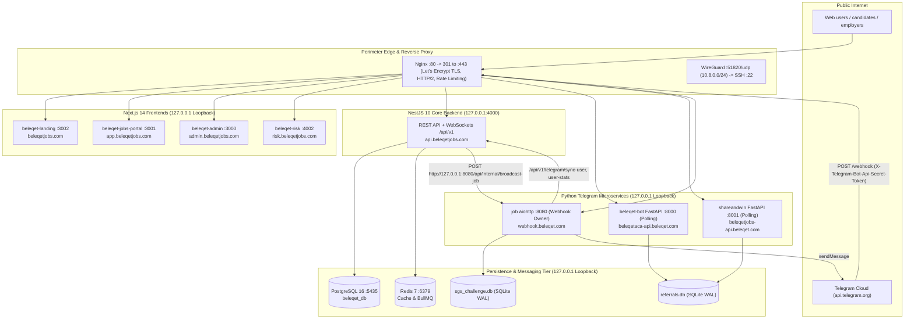
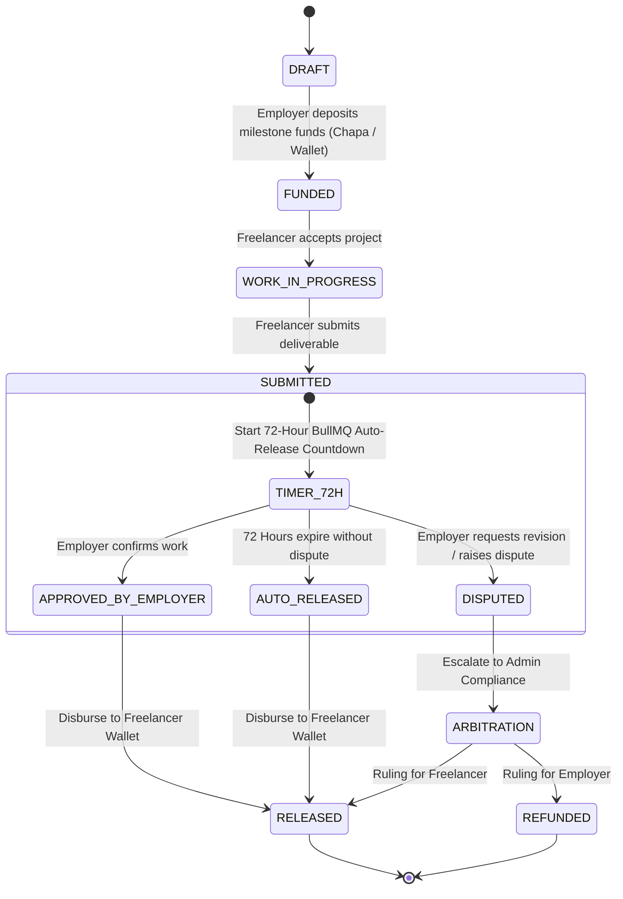

# Beleqet Jobs & Ecosystem: Engineering & Architecture Specification

| | |
|---|---|
| **Target Platform** | https://www.beleqetjobs.com |
| **Document Version** | 2.5.0 (Standalone Production Edition) |
| **Classification** | Technical Architecture, Network Security & Production Operations (Confidential) |
| **Audience** | Technical Leadership, Core Engineering & Operations |
| **Date** | October 2026 |
| **Status** | Production Specification & Verification Framework |

> **Conventions used in this document**
> - `<PLACEHOLDER>` values represent sensitive production credentials. Generate them securely as described in §8.2.
> - All service commands, systemd units, and Nginx blocks reflect production configurations tested against Ubuntu 24.04 LTS.
> - Persistence services, background workers, and internal microservices bind strictly to `127.0.0.1` (loopback).

---

## Table of Contents

1. [Executive Summary & System Architecture](#1-executive-summary--system-architecture)
2. [WordPress Decommissioning & API Transition](#2-wordpress-decommissioning--api-transition)
3. [Monorepo Structure & Application Matrix](#3-monorepo-structure--application-matrix)
4. [Comprehensive 60-Module Breakdown (`src/modules/`)](#4-comprehensive-60-module-breakdown-srcmodules)
5. [Bank API Integrations & Financial Architecture](#5-bank-api-integrations--financial-architecture)
6. [Python Telegram Bots & FastAPI Microservices](#6-python-telegram-bots--fastapi-microservices)
7. [API & Webhook Reference](#7-api--webhook-reference)
8. [Environment Setup & Master Configuration](#8-environment-setup--master-configuration)
9. [Network Security, UFW & WireGuard Playbook](#9-network-security-ufw--wireguard-playbook)
10. [Nginx Reverse Proxy, SSL & Multi-Domain Routing](#10-nginx-reverse-proxy-ssl--multi-domain-routing)
11. [Systemd Services Supervision (8 Core Services)](#11-systemd-services-supervision-8-core-services)
12. [Build, Release & Disaster Recovery Procedure](#12-build-release--disaster-recovery-procedure)
13. [Production Verification & Onboarding Workflows](#13-production-verification--onboarding-workflows)
- [Appendix: Codebase Confirmations & Architecture Decision Log](#appendix-codebase-confirmations--architecture-decision-log)

---

## 1. Executive Summary & System Architecture

The **Beleqet Ecosystem** is a unified hiring, freelance contracting, referral-reward and escrow platform built for the Ethiopian digital economy and international remote work. It provides:

1. A salaried jobs board with AI-driven resume parsing, automated candidate scoring and interview scheduling.
2. A freelance marketplace powered by **BeleqetSafe Escrow**, milestone-based fund segregation and auto-release timers.
3. Multi-channel payment rails: Chapa (Telebirr, CBE Birr, Awash Bank, Bank of Abyssinia, card payments) plus verified bank-slip reconciliation.
4. Three Python Telegram microservices managing community referral rewards, interactive quiz mini-apps and automated multichannel job broadcasts.
5. An enterprise-hardened network perimeter where administrative SSH is accessible **exclusively** through a dedicated WireGuard VPN subnet (`10.8.0.0/24`).

### 1.1 Architectural Topology



### 1.2 Broadcast Channel Ownership
The broadcast pipeline uses a dedicated loopback path:
* NestJS dispatches job publication payloads directly to the Python `job` service over loopback: `POST http://127.0.0.1:8080/api/internal/broadcast-job`.
* Public requests to `/api/internal/` are blocked with HTTP `403 Forbidden` at the Nginx edge.
* NestJS does not expose an external `/api/v1/telegram/broadcast-job` route, eliminating circular proxy overhead and token spoofing.

---

## 2. WordPress Decommissioning & API Transition

The legacy WordPress backend and all associated `WORDPRESS_API_URL` REST integrations are fully decommissioned. The NestJS backend (PostgreSQL on Port **5435**) serves as the single source of truth for users, jobs, applications, payments, and subscriptions across both web and Telegram.

All WordPress environment variables are superseded by direct NestJS API configurations:

```ini
BELEQET_API_BASE_URL=https://api.beleqetjobs.com/api/v1
BELEQET_API_SECRET_TOKEN=<GENERATED_64_HEX_KEY>
```

| Legacy WordPress Component | NestJS / PostgreSQL Replacement | Architectural Advantage |
|---|---|---|
| REST `/wp-json/wp/v2/jobs` | NestJS `GET/POST /api/v1/jobs` | Strongly typed DTOs, Zod/Class-Validator, indexed queries |
| `wp_posts` custom post types | PostgreSQL Prisma model `Job` | Relational foreign keys, full-text vector index, high concurrency |
| `wp_users` | PostgreSQL Prisma model `User` | Argon2/Bcrypt hash verification, RBAC permissions, multi-tier digital wallets |
| WP webhooks and plugins | BullMQ workers + EventEmitter2 | Guaranteed delivery, Redis distributed locking, exponential backoff retries |
| WordPress Admin Dashboard | Next.js Admin Portal (`admin.beleqetjobs.com`) | Granular RBAC, audit logs, inline trade license approval |

---

## 3. Monorepo Structure & Application Matrix

The repository contains four specialized Next.js 14 frontend applications, one unified NestJS 10 backend, and three Python Telegram microservices:

| Repository Directory | Application | Port | Production Domain | Primary Role |
|---|---|:---:|---|---|
| `src/` | `beleqet-backend` | **4000** | `api.beleqetjobs.com` | Core NestJS REST API, WebSockets, BullMQ workers |
| `beleqet-jobs-nextjs/` | `beleqet-jobs-portal` | **3001** | `app.beleqetjobs.com` | Candidate jobs board, applicant pipeline, freelance/escrow UI |
| `frontend-main/` | `beleqet-landing` | **3002** | `beleqetjobs.com`, `www.beleqetjobs.com` | High-conversion marketing landing pages and SEO discovery |
| `frontend/` | `beleqet-admin` | **3000** | `admin.beleqetjobs.com` | Administrative management, KYC trade license audits |
| `web/` | `beleqet-risk` | **4002** | `risk.beleqetjobs.com` | Fraud detection, AML transaction monitoring, disputes |
| `bots/beleqet-bot/` | `beleqet-bot` | **8000** | `beleqetaca-api.beleqet.com` | FastAPI + Polling: Academy referral rewards, mini-app |
| `bots/shareandwin/` | `shareandwin` | **8001** | `beleqetjobs-api.beleqet.com` | FastAPI + Polling: Jobs Share-and-Win rewards |
| `bots/job/` | `beleqet-jobs-bot` | **8080** | `webhook.beleqet.com` | aiohttp + **Webhook**: Candidate registration, SGS Challenge, broadcasts |

> **Host-Based Routing Architecture:** Portal (`app.beleqetjobs.com`) and Landing (`beleqetjobs.com`) are separated by **subdomain**, not by URL path. Because both are Next.js applications that emit `/_next/static/` chunks, path-based routing on a single domain causes chunk collision and hydration mismatches. Authenticated application routes requested on the apex domain are 301-redirected to `app.beleqetjobs.com` at the Nginx edge.

---

## 4. Comprehensive 60-Module Breakdown (`src/modules/`)

The core NestJS backend contains **60 functional modules** organized into 8 functional architectural domains:

### Domain 1: Identity, Authentication & Granular Access Control
1. **`auth` (`src/modules/auth`)**: JWT issuance, token rotation, bcrypt password hashing, and session invalidation.
2. **`users` (`src/modules/users`)**: Profile data management, user metadata, account status, and Telegram ID linkage.
3. **`rbac` (`src/modules/rbac`)**: Granular Role-Based Access Control enforcing platform permissions across `ADMIN`, `EMPLOYER`, `JOB_SEEKER`, and `FREELANCER`.
4. **`two-factor` (`src/modules/two-factor`)**: TOTP enrollment, encrypted secret storage, backup codes, and step-up challenge tokens.
5. **`user-preferences` (`src/modules/user-preferences`)**: Notification channels, UI themes, and locale settings.

### Domain 2: Financial Rails, Escrow & Banking
6. **`payments` (`src/modules/payments`)**: Core payment orchestration for Chapa, Telebirr, CBE Birr, and card rails.
7. **`chapa` (`src/modules/chapa`)**: Dedicated Chapa client integration, checkout redirect generation, and transaction verification.
8. **`beleqet-pay` (`src/modules/beleqet-pay`)**: Internal payment processing hub and unified transaction ledger.
9. **`escrow` (`src/modules/escrow`)**: BeleqetSafe milestone fund locking, dispute state machines, and automated 72h release timers.
10. **`wallet` (`src/modules/wallet`)**: Ledger tracking `availableBalance` (withdrawable) vs `pendingBalance` (milestone-locked).
11. **`manual-payment` (`src/modules/manual-payment`)**: Offline bank transfer reconciliation with bank slip upload and administrative audit.
12. **`billing` (`src/modules/billing`)**: Invoice generation, receipt PDF dispatch, and financial history.
13. **`subscriptions` (`src/modules/subscriptions`)**: Employer subscription plans, billing tiers, and recurring job posting quotas.
14. **`plans` (`src/modules/plans`)**: Product catalog defining employer subscription tiers and feature matrix.
15. **`tax-calculator` (`src/modules/tax-calculator`)**: Ethiopian statutory income tax, pension withholding, and net salary calculators.

### Domain 3: Jobs Board, Taxonomy & Candidate Pipeline
16. **`jobs` (`src/modules/jobs`)**: Job posting CRUD, 56-category taxonomy, salary range validation, and search indexing.
17. **`applications` (`src/modules/applications`)**: Multi-stage applicant tracking (`APPLIED → REVIEWING → SHORTLISTED → INTERVIEW → OFFERED / REJECTED`).
18. **`matching` (`src/modules/matching`)**: Algorithmic pairing of candidate skill vectors with open job requirements.
19. **`interview-planner` (`src/modules/interview-planner`)**: Calendar scheduling, Google Meet integration, and automated candidate reminders.
20. **`salary` (`src/modules/salary`)**: Compensation benchmark analysis and salary insights engine.
21. **`promoted-engine` (`src/modules/promoted-engine`)**: Featured job listings, sponsored search rankings, and campaign budgets.
22. **`search` (`src/modules/search`)**: Full-text job indexing, fuzzy matching, and multi-criteria filters.

### Domain 4: Freelance Marketplace, Bidding & Contracts
23. **`freelance` (`src/modules/freelance`)**: Freelance gig postings, project scope definitions, and client-freelancer interactions.
24. **`smart-bidding` (`src/modules/smart-bidding`)**: AI-assisted bid recommendation engine analyzing market rates and scope complexity.
25. **`review` (`src/modules/review`)**: Double-blind post-project feedback, 5-star ratings, and reputation scoring.
26. **`dispute-manager` (`src/modules/dispute-manager`)**: Formal escrow milestone arbitration and administrative dispute resolution.

### Domain 5: AI, Machine Learning & Intelligent Assessment
27. **`resume-brain` (`src/modules/resume-brain`)**: Automated PDF/DOCX CV text extraction, skill tokenization, and profile enhancement.
28. **`screening` (`src/modules/screening`)**: Automated OpenAI candidate screening and scoring (0–100 match rating).
29. **`ai-feed` (`src/modules/ai-feed`)**: Personalized activity feeds and smart opportunity streams.
30. **`video-interview` (`src/modules/video-interview`)**: Automated video interview recording and Whisper audio transcription.
31. **`plagiarism` (`src/modules/plagiarism`)**: Proposal and portfolio text similarity analysis to prevent duplicate spam bids.
32. **`smart-skill-tester` (`src/modules/smart-skill-tester`)**: Interactive candidate technical quizzes and verified skill badges.

### Domain 6: Security, Risk, Audit & Compliance
33. **`kyc` (`src/modules/kyc`)**: National ID, passport, and company trade license document verification.
34. **`audit` (`src/modules/audit`)**: Append-only administrative action logging with IP address, user-agent, and before/after diffs.
35. **`audit-log` (`src/modules/audit-log`)**: Event ingestion pipeline for compliance audit records.
36. **`audit-logging` (`src/modules/audit-logging`)**: Storage engine and historical query interface for system audit trails.
37. **`fraud-alert` (`src/modules/fraud-alert`)**: Security alert triggers for suspicious user activities and rapid withdrawals.
38. **`anomaly-sensor` (`src/modules/anomaly-sensor`)**: Real-time heuristics monitoring multi-account registrations and IP hopping.
39. **`gdpr-guard` (`src/modules/gdpr-guard`)**: Right-to-be-forgotten user data anonymization and GDPR archive exports.
40. **`encrypted-inbox` (`src/modules/encrypted-inbox`)**: End-to-end encrypted direct messaging between employers and freelancers.

### Domain 7: Communications, Messaging & Background Queues
41. **`chat` (`src/modules/chat`)**: Real-time Socket.IO chat messaging, typing indicators, and read receipts.
42. **`chat-to-text` (`src/modules/chat-to-text`)**: Voice message audio transcription pipeline.
43. **`notifications` (`src/modules/notifications`)**: Multi-channel notification routing (in-app alerts, email, and Telegram).
44. **`telegram` (`src/modules/telegram`)**: Telegram Mini App `initData` HMAC validation, user synchronization, and broadcast dispatch.
45. **`faq-bot` (`src/modules/faq-bot`)**: Automated AI assistant answering platform questions.
46. **`community-forum` (`src/modules/community-forum`)**: Public discussion threads, knowledge sharing, and peer support.
47. **`contact` (`src/modules/contact`)**: Customer support ticket submission and contact inquiry routing.
48. **`email-automation` (`src/modules/email-automation`)**: Transactional email templates, MJML rendering, and SendGrid/SES dispatchers.
49. **`webhooks` (`src/modules/webhooks`)**: Outbound webhook delivery to third-party employer ATS integrations.
50. **`queues` (`src/modules/queues`)**: BullMQ queue definitions and distributed job lifecycle management.

### Domain 8: Platform Administration & Infrastructure
51. **`admin` (`src/modules/admin`)**: Core administrative operations and user management controllers.
52. **`admin-control` (`src/modules/admin-control`)**: System feature toggles, platform maintenance modes, and rate-limit tuning.
53. **`admin-stats` (`src/modules/admin-stats`)**: Real-time platform metrics, GMV, active users, and CSV data export.
54. **`analytics` (`src/modules/analytics`)**: User engagement metrics, funnel conversion tracking, and retention analytics.
55. **`graphql-turbo` (`src/modules/graphql-turbo`)**: High-speed GraphQL API layer for mobile clients and mini-apps.
56. **`uploads` (`src/modules/uploads`)**: Cloudflare R2 / AWS S3 presigned URL generation with strict MIME validation.
57. **`redis` (`src/modules/redis`)**: Redis client pooling, distributed caching, and session store.
58. **`db-index-master` (`src/modules/db-index-master`)**: Automated database index optimization and query performance tracking.
59. **`scheduler` (`src/modules/scheduler`)**: Cron-based background jobs, daily ledger balancing, and temporary file pruning.
60. **`health` (`src/modules/health`)**: Liveness and readiness health probes checking PostgreSQL, Redis, and disk storage.

---

## 5. Bank API Integrations & Financial Architecture

### 5.1 Chapa Payment Gateway & Webhook Signature Verification

All electronic deposits, employer subscriptions, and milestone fundings utilize Chapa:
* Verification uses the **raw request body** (`req.rawBody`) with constant-time equality check (`timingSafeEqual`) to prevent timing attack vulnerabilities.
* The system accepts both `x-chapa-signature` and `chapa-signature` headers, normalizing any optional `sha256=` prefix.

```typescript
import { Injectable, UnauthorizedException } from '@nestjs/common';
import { ConfigService } from '@nestjs/config';
import { createHmac, timingSafeEqual } from 'crypto';

@Injectable()
export class ChapaSignatureService {
  constructor(private readonly config: ConfigService) {}

  verifyWebhook(rawBody: Buffer, headers: Record<string, string | string[] | undefined>): boolean {
    const secret = this.config.get<string>('CHAPA_WEBHOOK_SECRET');
    if (!secret || !rawBody) return false;

    const received = this.header(headers, 'x-chapa-signature') ?? this.header(headers, 'chapa-signature');
    const normalized = received?.trim().replace(/^sha256=/i, '');
    if (!normalized || !/^[a-f0-9]{64}$/i.test(normalized)) return false;

    const expected = createHmac('sha256', secret).update(rawBody.toString('utf8')).digest('hex');

    const a = Buffer.from(normalized, 'hex');
    const b = Buffer.from(expected, 'hex');
    return a.length === b.length && timingSafeEqual(a, b);
  }

  private header(headers: Record<string, string | string[] | undefined>, name: string): string | undefined {
    const val = Object.entries(headers).find(([k]) => k.toLowerCase() === name)?.[1];
    return Array.isArray(val) ? val[0] : val;
  }
}
```

> **Idempotency Rule:** Webhook events are processed idempotently based on `tx_ref`. If Chapa retries delivery for an already-credited transaction, the service records the duplicate delivery and returns `200 OK` without altering balances.

### 5.2 Local Ethiopian Bank Rails & Manual Reconciliation

For deposits via Commercial Bank of Ethiopia (CBE), Awash Bank, or Bank of Abyssinia:
1. Employer initiates a deposit request selecting *Bank Transfer*.
2. System generates a unique transaction reference: `REF-CBE-YYYYMMDD-XXXXX`.
3. Employer uploads the bank deposit slip image via `POST /api/v1/manual-payment/submit`.
4. Admin reviews slip and confirms ledger entry in the Admin Dashboard: `POST /api/v1/manual-payment/approve/:id`.
5. Funds are credited instantly to the employer's available balance in an atomic transaction.

### 5.3 BeleqetSafe Escrow Engine & Auto-Release Lifecycle



### 5.4 Digital Wallets & Step-Up 2FA Security

- **`FreelancerWallet`**: Maintains `availableBalance` (withdrawable) and `pendingBalance` (milestone-locked).
- **Step-Up 2FA on Withdrawals**:
  Withdrawal requests (`POST /api/v1/wallet/withdraw`) strictly require an `x-step-up-token` header. The token is obtained via `POST /api/v1/auth/2fa/step-up` by verifying a 6-digit TOTP code and is valid for exactly 5 minutes.

---

## 6. Python Telegram Bots & FastAPI Microservices

### 6.1 Overview & Routing Matrix

| Service | Framework | Port | Telegram Mode | Public Domain | Database |
|---|---|:---:|---|---|---|
| `beleqet-bot` | FastAPI | **8000** | Long Polling | `beleqetaca-api.beleqet.com` | `referrals.db` |
| `shareandwin` | FastAPI | **8001** | Long Polling | `beleqetjobs-api.beleqet.com` | `referrals.db` |
| `job` | aiohttp | **8080** | **Webhook** | `webhook.beleqet.com` | `sgs_challenge.db` |

> **Single Poller Rule:** Each long-polling service (`beleqet-bot`, `shareandwin`) must use its own distinct bot token and run with `--workers 1`. Multiple workers polling the same bot token cause Telegram `409 Conflict: terminated by other getUpdates request` errors and duplicate referral crediting.

### 6.2 The Three Telegram Bot Services

1. **`beleqet-bot` (Academy Referral Rewards & Mini-App)**
   * Awards points for educational course referrals and serves Academy Mini-App APIs (`/academy/api/...`).
   * Operates via dedicated Telegram bot token in long polling mode.

2. **`shareandwin` (Jobs Share-and-Win Referral Rewards)**
   * Generates trackable referral links for telegram channels and groups, manages user point balances, ETB conversion, and withdrawal payouts.
   * Operates via dedicated Telegram bot token in long polling mode.

3. **`job` (Main Jobs Registration Bot & SGS Challenge Mini-App)**
   * Handles `/start` user onboarding, receives job publication webhooks from NestJS, and posts formatted job cards to `@beleqetjobs` and `@beleqetcommunity`.
   * Serves the interactive **SGS Challenge Mini-App** (`/challenge/...`).
   * **This service is the sole owner of the job bot's Telegram webhook.**

### 6.3 SQLite Concurrency & Operating Rules

1. Enable WAL mode, busy timeout, and foreign key enforcement on every connection:
   ```python
   conn = sqlite3.connect(path, timeout=10, isolation_level=None)
   conn.execute("PRAGMA journal_mode=WAL;")
   conn.execute("PRAGMA busy_timeout=5000;")
   conn.execute("PRAGMA foreign_keys=ON;")
   ```
2. All multi-statement write transactions must use `BEGIN IMMEDIATE` to obtain the write lock immediately and eliminate mid-transaction `SQLITE_BUSY` deadlocks.
3. Database backups must be executed via `sqlite3 <db> ".backup '/opt/beleqet/backups/<name>-$(date +%F).db'"` (never copy a live WAL database directly).

### 6.4 SQLite Database Schemas

#### 1. `referrals.db` (Referral Points, Rewards & Withdrawals)

```sql
CREATE TABLE IF NOT EXISTS users (
  telegram_id         INTEGER PRIMARY KEY,
  username            TEXT,
  first_name          TEXT NOT NULL,
  referral_code       TEXT UNIQUE NOT NULL,
  referred_by         INTEGER,
  points_balance      INTEGER DEFAULT 0,
  etb_balance         REAL    DEFAULT 0.0,
  total_withdrawn_etb REAL    DEFAULT 0.0,
  is_active           INTEGER DEFAULT 1,
  created_at          TIMESTAMP DEFAULT CURRENT_TIMESTAMP,
  updated_at          TIMESTAMP DEFAULT CURRENT_TIMESTAMP
);

CREATE TABLE IF NOT EXISTS referrals (
  id              INTEGER PRIMARY KEY AUTOINCREMENT,
  referrer_id     INTEGER NOT NULL,
  referred_id     INTEGER NOT NULL UNIQUE,
  points_awarded  INTEGER NOT NULL,
  etb_equivalent  REAL    NOT NULL,
  status          TEXT DEFAULT 'CONFIRMED',   -- 'PENDING','CONFIRMED','FRAUD_FLAGGED'
  created_at      TIMESTAMP DEFAULT CURRENT_TIMESTAMP,
  FOREIGN KEY (referrer_id) REFERENCES users(telegram_id),
  FOREIGN KEY (referred_id) REFERENCES users(telegram_id)
);

CREATE TABLE IF NOT EXISTS withdrawals (
  id              INTEGER PRIMARY KEY AUTOINCREMENT,
  telegram_id     INTEGER NOT NULL,
  amount_etb      REAL    NOT NULL,
  points_deducted INTEGER NOT NULL,
  payment_method  TEXT NOT NULL,              -- 'TELEBIRR','CBE_BIRR','BANK_TRANSFER'
  account_number  TEXT NOT NULL,
  account_name    TEXT NOT NULL,
  status          TEXT DEFAULT 'PENDING',     -- 'PENDING','PROCESSING','APPROVED','REJECTED','FAILED','REFUNDED'
  admin_notes     TEXT,
  created_at      TIMESTAMP DEFAULT CURRENT_TIMESTAMP,
  reviewed_at     TIMESTAMP,
  FOREIGN KEY (telegram_id) REFERENCES users(telegram_id)
);

CREATE TABLE IF NOT EXISTS withdrawal_refund_log (
  id              INTEGER PRIMARY KEY AUTOINCREMENT,
  withdrawal_id   INTEGER NOT NULL UNIQUE,    -- Unique: a withdrawal can be refunded only once
  telegram_id     INTEGER NOT NULL,
  amount_etb      REAL    NOT NULL,
  points_refunded INTEGER NOT NULL,
  reason          TEXT    NOT NULL,
  created_at      TIMESTAMP DEFAULT CURRENT_TIMESTAMP,
  FOREIGN KEY (withdrawal_id) REFERENCES withdrawals(id)
);

CREATE INDEX IF NOT EXISTS idx_users_referral_code ON users(referral_code);
CREATE INDEX IF NOT EXISTS idx_withdrawals_status  ON withdrawals(status);
CREATE INDEX IF NOT EXISTS idx_withdrawals_user    ON withdrawals(telegram_id);
```

#### 2. `sgs_challenge.db` (SGS Challenge Mini-App)

```sql
CREATE TABLE IF NOT EXISTS challenge_users (
  telegram_id   INTEGER PRIMARY KEY,
  full_name     TEXT NOT NULL,
  phone_number  TEXT,
  total_score   INTEGER DEFAULT 0,
  current_level INTEGER DEFAULT 1,
  streak_days   INTEGER DEFAULT 0,
  last_active   TIMESTAMP DEFAULT CURRENT_TIMESTAMP
);

CREATE TABLE IF NOT EXISTS questions (
  id                 INTEGER PRIMARY KEY AUTOINCREMENT,
  category           TEXT NOT NULL,            -- 'SOFTWARE','MARKETING','ACCOUNTING','GENERAL'
  question_text      TEXT NOT NULL,
  option_a           TEXT NOT NULL,
  option_b           TEXT NOT NULL,
  option_c           TEXT NOT NULL,
  option_d           TEXT NOT NULL,
  correct_option     TEXT NOT NULL,            -- 'A','B','C','D'
  points             INTEGER DEFAULT 10,
  time_limit_seconds INTEGER DEFAULT 30,
  is_active          INTEGER DEFAULT 1
);

CREATE TABLE IF NOT EXISTS user_submissions (
  id                 INTEGER PRIMARY KEY AUTOINCREMENT,
  telegram_id        INTEGER NOT NULL,
  question_id        INTEGER NOT NULL,
  selected_option    TEXT NOT NULL,
  is_correct         INTEGER NOT NULL,         -- 1 true, 0 false
  time_taken_seconds INTEGER NOT NULL,
  submitted_at       TIMESTAMP DEFAULT CURRENT_TIMESTAMP,
  UNIQUE (telegram_id, question_id),           -- Prevents re-submitting for extra points
  FOREIGN KEY (telegram_id) REFERENCES challenge_users(telegram_id),
  FOREIGN KEY (question_id) REFERENCES questions(id)
);

CREATE TABLE IF NOT EXISTS broadcast_log (
  job_id       TEXT PRIMARY KEY,
  message_refs TEXT,                           -- JSON tracking channel & message ids
  created_at   TIMESTAMP DEFAULT CURRENT_TIMESTAMP
);

CREATE VIEW IF NOT EXISTS leaderboard_view AS
SELECT
  cu.telegram_id,
  cu.full_name,
  cu.total_score,
  COUNT(us.id) AS total_answered,
  SUM(CASE WHEN us.is_correct = 1 THEN 1 ELSE 0 END) AS correct_answers,
  ROUND(CAST(SUM(CASE WHEN us.is_correct = 1 THEN 1 ELSE 0 END) AS REAL)
        / MAX(COUNT(us.id), 1) * 100, 2) AS accuracy_pct
FROM challenge_users cu
LEFT JOIN user_submissions us ON cu.telegram_id = us.telegram_id
GROUP BY cu.telegram_id, cu.full_name, cu.total_score
ORDER BY cu.total_score DESC;
```

---

### 6.5 Points, ETB Calculation & Atomic Withdrawal Refund Logic

* **Conversion Rate:** `1 Point = 0.50 ETB` (100 Points = 50.00 ETB).
* **Referral Bonus:** Referrer receives **50 Points (25.00 ETB)**; newly referred user receives a **20-Point (10.00 ETB)** welcome bonus.
* **Minimum Withdrawal:** **200 Points (100.00 ETB)**.

#### Atomic Withdrawal Refund Transaction
If an administrative payout is rejected (e.g. incorrect account details) or fails, deducted points and ETB are restored in an atomic transaction:

```python
import sqlite3

REFUNDABLE = ("PENDING", "PROCESSING", "REJECTED", "FAILED")

def refund_rejected_withdrawal(db_path: str, withdrawal_id: int, reason: str) -> bool:
    conn = sqlite3.connect(db_path, timeout=10, isolation_level=None)
    conn.execute("PRAGMA busy_timeout=5000;")
    conn.execute("PRAGMA foreign_keys=ON;")
    try:
        conn.execute("BEGIN IMMEDIATE")

        row = conn.execute(
            "SELECT telegram_id, amount_etb, points_deducted, status FROM withdrawals WHERE id = ?",
            (withdrawal_id,),
        ).fetchone()
        if not row:
            raise ValueError(f"Withdrawal #{withdrawal_id} not found")
        telegram_id, amount_etb, points_deducted, status = row
        if status not in REFUNDABLE:
            raise ValueError(f"Cannot refund withdrawal with status '{status}'")

        cur = conn.execute(
            f"""UPDATE withdrawals
                   SET status='REFUNDED', admin_notes=?, reviewed_at=CURRENT_TIMESTAMP
                 WHERE id=? AND status IN ({",".join("?" * len(REFUNDABLE))})""",
            (f"Refunded: {reason}", withdrawal_id, *REFUNDABLE),
        )
        if cur.rowcount != 1:
            raise RuntimeError("Withdrawal state changed concurrently; refund aborted")

        conn.execute(
            """UPDATE users
                  SET points_balance = points_balance + ?,
                      etb_balance    = etb_balance + ?,
                      updated_at     = CURRENT_TIMESTAMP
                WHERE telegram_id = ?""",
            (points_deducted, amount_etb, telegram_id),
        )
        conn.execute(
            """INSERT INTO withdrawal_refund_log
                 (withdrawal_id, telegram_id, amount_etb, points_refunded, reason)
               VALUES (?, ?, ?, ?, ?)""",
            (withdrawal_id, telegram_id, amount_etb, points_deducted, reason),
        )
        conn.execute("COMMIT")
        return True
    except Exception:
        conn.execute("ROLLBACK")
        raise
    finally:
        conn.close()
```

---

### 6.6 Job Publishing & Auto-Broadcast Workflow

1. An employer publishes a job vacancy on `https://www.beleqetjobs.com` (`POST /api/v1/jobs`).
2. NestJS saves the job in PostgreSQL and dispatches a BullMQ background task (`jobId = job.id`).
3. The BullMQ worker dispatches an HTTP request over loopback:
   * **Target:** `POST http://127.0.0.1:8080/api/internal/broadcast-job`
   * **Header:** `x-beleqet-secret-token: <BELEQET_API_SECRET_TOKEN>`
   * **Payload:**
     ```json
     {
       "jobId": "clx123",
       "title": "Senior Backend Engineer",
       "company": "Acme Tech PLC",
       "salaryRange": "45,000 - 70,000 ETB",
       "category": "Software Development",
       "applyUrl": "https://app.beleqetjobs.com/jobs/clx123"
     }
     ```
4. The `job` bot verifies the secret token, checks `broadcast_log` for duplicate delivery, formats the interactive card with inline apply buttons, and broadcasts to `@beleqetjobs` and `@beleqetcommunity`.
5. The endpoint records the broadcast in `broadcast_log` and returns `200 {"status":"sent"}`.

---

## 7. API & Webhook Reference

All core backend endpoints are prefixed with `/api/v1`. Protected endpoints require an `Authorization: Bearer <JWT>` header.

### 7.1 Authentication & Profile Lifecycle (`/auth`)

| Method | Endpoint | Access | Purpose |
|---|---|:---:|---|
| POST | `/auth/register` | Public | Register candidate or employer account |
| POST | `/auth/login` | Public | Authenticate user; returns access and refresh JWTs |
| POST | `/auth/refresh` | Public | Exchange refresh token for a fresh access token |
| POST | `/auth/2fa/challenge` | JWT | Request a 2FA challenge token for high-risk actions |
| POST | `/auth/2fa/step-up` | JWT | Validate TOTP code and issue verified 5-minute `x-step-up-token` |

### 7.2 Jobs Board & Pipeline (`/jobs`, `/applications`)

| Method | Endpoint | Access | Purpose |
|---|---|:---:|---|
| GET | `/jobs` | Public | Paginated listings with search and category filters |
| GET | `/jobs/:id` | Public | Full vacancy details and employer profile |
| POST | `/jobs` | `EMPLOYER` | Publish a job vacancy; triggers Telegram broadcast |
| POST | `/applications` | `JOB_SEEKER` | Submit CV and cover letter for a vacancy |
| PATCH | `/applications/:id/status` | `EMPLOYER` | Advance candidate (`SHORTLISTED`, `INTERVIEW`, `OFFERED`, `REJECTED`) |

### 7.3 Financial Rails, Escrow & Wallets (`/payments`, `/escrow`, `/wallet`)

| Method | Endpoint | Access | Purpose |
|---|---|:---:|---|
| POST | `/payments/chapa/webhook` | Webhook (HMAC) | Chapa payment confirmation callback |
| POST | `/manual-payment/submit` | `EMPLOYER` | Upload offline bank transfer slip |
| POST | `/manual-payment/approve/:id` | `ADMIN` | Audit and approve deposit slip; credit wallet |
| POST | `/escrow/deposit` | `EMPLOYER` | Fund project milestone into escrow |
| POST | `/escrow/milestone/:id/submit`| `FREELANCER` | Submit milestone deliverables; starts 72h timer |
| POST | `/escrow/milestone/:id/approve`| `EMPLOYER` | Release escrowed funds directly to freelancer |
| POST | `/wallet/withdraw` | JWT + 2FA | Payout request protected by `x-step-up-token` |

### 7.4 Telegram Webhooks & SGS Challenge APIs

| Method | Endpoint | Host | Authentication | Purpose |
|---|---|---|:---:|---|
| POST | `/webhook` | `webhook.beleqet.com` | `X-Telegram-Bot-Api-Secret-Token` | Telegram Cloud server update webhook |
| GET | `/challenge/api/user` | `webhook.beleqet.com` | TMA InitData | Fetch user score, rank, and streak |
| GET | `/challenge/api/questions` | `webhook.beleqet.com` | TMA InitData | Retrieve categorized skill challenge questions |
| POST | `/challenge/api/submit` | `webhook.beleqet.com` | TMA InitData | Submit quiz answers and accumulate skill points |
| GET | `/challenge/api/leaderboard` | `webhook.beleqet.com` | Public | Top leaderboard rankings |

### 7.5 Service-to-Service Internal Endpoints

| Method | Endpoint | Caller → Target | Header | Purpose |
|---|---|---|---|---|
| POST | `/api/internal/broadcast-job` | NestJS → `job` (:8080) | `x-beleqet-secret-token` | Broadcast job card to Telegram channels |
| POST | `/api/v1/telegram/sync-user` | Python Bot → NestJS (:4000) | `x-beleqet-secret-token` | Link Telegram user ID to candidate profile |
| GET | `/api/v1/telegram/user-stats/:id` | Python Bot → NestJS (:4000) | `x-beleqet-secret-token` | Fetch candidate profile completeness |

---

## 8. Environment Setup & Master Configuration

### 8.1 PostgreSQL Port Architecture (Port 5435)

PostgreSQL operates on **Port 5435** to prevent port collisions with existing database services. When deployed via Docker Compose, publish PostgreSQL on loopback only:

```yaml
ports:
  - "127.0.0.1:5435:5432"
```

> **UFW Bypass Protection:** Docker modifies iptables directly and bypasses UFW rules. Specifying `127.0.0.1:5435:5432` ensures the port is bound strictly to the local loopback interface and remains invisible to the public internet. Redis must be similarly bound: `127.0.0.1:6379:6379`.

### 8.2 Cryptographic Key Generation

Generate secrets on the production server:

```bash
openssl rand -hex 32     # JWT_SECRET
openssl rand -hex 32     # JWT_REFRESH_SECRET (must be distinct from JWT_SECRET)
openssl rand -hex 32     # ENCRYPTION_KEY (64 hex characters = 32 bytes AES-256)
openssl rand -hex 32     # BELEQET_API_SECRET_TOKEN (shared across NestJS and bots)
openssl rand -hex 32     # WEBHOOK_SECRET_TOKEN (Telegram allows A-Z, a-z, 0-9, _, -)
openssl rand -base64 24  # Database and Redis passwords
```

### 8.3 The 5 Critical Production Configurations

| Config Key | Production Value | Verification & Enforcement |
|---|---|---|
| `DATABASE_URL` | `postgresql://beleqet_user:<PASS>@127.0.0.1:5435/beleqet_db?schema=public&connection_limit=30` | Strictly on Port 5435, connection limit 30 |
| `CHAPA_WEBHOOK_SECRET` | Live HMAC secret from Chapa dashboard | Validated via `ChapaSignatureService` raw-body check |
| SMTP Credentials | Production SendGrid/SES Host, Port 587, User, Pass | Active SPF and DKIM DNS records for `@beleqetjobs.com` |
| `BASE_URL & Callback URLs` | `https://beleqetjobs.com`, `https://api.beleqetjobs.com/api/v1` | Guarantees zero `localhost` links in emails or callbacks |
| `BELEQET_API_SECRET_TOKEN` | 64-character hex secret string | Identical token configured across NestJS and all bots |

### 8.4 Master Backend Environment (`/opt/beleqet/beleqet-ecosystem-updated/.env`)

```ini
NODE_ENV=production
PORT=4000
BASE_URL=https://beleqetjobs.com
API_BASE_URL=https://api.beleqetjobs.com/api/v1
APP_BASE_URL=https://app.beleqetjobs.com
FRONTEND_URL=https://beleqetjobs.com,https://www.beleqetjobs.com,https://app.beleqetjobs.com,https://admin.beleqetjobs.com,https://risk.beleqetjobs.com
SESSION_SECRET=<GENERATE_64_HEX>

# Persistence (Loopback Only)
DATABASE_URL="postgresql://beleqet_user:<DB_PASSWORD>@127.0.0.1:5435/beleqet_db?schema=public&connection_limit=30"
REDIS_HOST=127.0.0.1
REDIS_PORT=6379
REDIS_PASSWORD=<GENERATE_REDIS_PASSWORD>
REDIS_TLS=false

# Security & Service Tokens
JWT_SECRET=<GENERATE_64_HEX>
JWT_EXPIRATION=15m
JWT_REFRESH_SECRET=<GENERATE_DISTINCT_64_HEX>
JWT_REFRESH_EXPIRATION=7d
ENCRYPTION_KEY=<GENERATE_64_HEX>
BELEQET_API_SECRET_TOKEN=<GENERATE_64_HEX>

# Chapa Payment Gateway
CHAPA_SECRET_KEY=<LIVE_CHAPA_SECRET_KEY>
CHAPA_PUBLIC_KEY=<LIVE_CHAPA_PUBLIC_KEY>
CHAPA_WEBHOOK_SECRET=<LIVE_CHAPA_WEBHOOK_SECRET>
CHAPA_BASE_URL=https://api.chapa.co/v1
CHAPA_CALLBACK_URL=https://api.beleqetjobs.com/api/v1/payments/chapa/webhook
CHAPA_RETURN_URL=https://app.beleqetjobs.com/dashboard/payments/success

# Transactional SMTP
SMTP_HOST=smtp.sendgrid.net
SMTP_PORT=587
SMTP_SECURE=false
SMTP_USER=apikey
SMTP_PASS=<SENDGRID_API_KEY>
SMTP_FROM="Beleqet Jobs <no-reply@beleqetjobs.com>"

# Telegram Ecosystem
TELEGRAM_ENABLED=true
TELEGRAM_BOT_TOKEN=<JOB_BOT_TOKEN>
TELEGRAM_CHANNEL_ID=-1001234567890
TELEGRAM_WEBAPP_URL=https://webhook.beleqet.com/challenge
BOT_BROADCAST_URL=http://127.0.0.1:8080/api/internal/broadcast-job

# AI Services
OPENAI_API_KEY=<OPENAI_API_KEY>
OPENAI_MODEL=gpt-4o-mini
```

### 8.5 Master Python Bot Environments

**`bots/job/.env`** (Webhook Mode)
```ini
BOT_TOKEN=<JOB_BOT_TOKEN>
BOT_WEBHOOK_URL=https://webhook.beleqet.com/webhook
WEBHOOK_SECRET_TOKEN=<GENERATE_SECRET_TOKEN>
PORT=8080
HOST=127.0.0.1

BELEQET_API_BASE_URL=https://api.beleqetjobs.com/api/v1
BELEQET_API_SECRET_TOKEN=<MATCHING_BELEQET_API_SECRET_TOKEN>

SGS_DB_PATH=/opt/beleqet/bots/data/sgs_challenge.db
REFERRALS_DB_PATH=/opt/beleqet/bots/data/referrals.db

MINI_APP_URL=https://webhook.beleqet.com/challenge
JOBS_PORTAL_URL=https://beleqetjobs.com
TELEGRAM_JOBS_CHANNEL_ID=-1001234567890
TELEGRAM_DISCUSSION_GROUP_ID=-1009876543210
```

**`bots/shareandwin/.env`** (Polling Mode)
```ini
BOT_TOKEN=<SHAREANDWIN_BOT_TOKEN>
PORT=8001
HOST=127.0.0.1
REFERRALS_DB_PATH=/opt/beleqet/bots/data/referrals.db
BELEQET_API_BASE_URL=https://api.beleqetjobs.com/api/v1
BELEQET_API_SECRET_TOKEN=<MATCHING_BELEQET_API_SECRET_TOKEN>
JOBS_PORTAL_URL=https://beleqetjobs.com
```

**`bots/beleqet-bot/.env`** (Polling Mode)
```ini
BOT_TOKEN=<ACADEMY_BOT_TOKEN>
PORT=8000
HOST=127.0.0.1
REFERRALS_DB_PATH=/opt/beleqet/bots/data/referrals.db
BELEQET_API_BASE_URL=https://api.beleqetjobs.com/api/v1
BELEQET_API_SECRET_TOKEN=<MATCHING_BELEQET_API_SECRET_TOKEN>
```

---

## 9. Network Security, UFW & WireGuard Playbook

> **Perimeter Security Mandate:** Port 22 must never be reachable from the public internet (`0.0.0.0/0`). Administrative SSH is restricted exclusively to the private WireGuard VPN subnet `10.8.0.0/24`.

### 9.1 Lockout-Safe Ordered Procedure

Execute these steps in exact sequence. **Do not remove the public SSH rule until Step 5 is verified**, keeping your VPS console active in an open terminal.

**Step 1: Install WireGuard and generate server keys**
```bash
sudo apt update && sudo apt install -y wireguard
umask 077
wg genkey | sudo tee /etc/wireguard/server.key | wg pubkey | sudo tee /etc/wireguard/server.pub
```

**Step 2: Server configuration `/etc/wireguard/wg0.conf`**
```ini
[Interface]
Address = 10.8.0.1/24
ListenPort = 51820
PrivateKey = <SERVER_PRIVATE_KEY>

[Peer]
# Admin Peer
PublicKey = <ADMIN_LAPTOP_PUBLIC_KEY>
AllowedIPs = 10.8.0.2/32
```

**Step 3: Admin laptop client configuration**
```ini
[Interface]
Address = 10.8.0.2/24
PrivateKey = <ADMIN_LAPTOP_PRIVATE_KEY>

[Peer]
PublicKey = <SERVER_PUBLIC_KEY>
Endpoint = <SERVER_PUBLIC_IP>:51820
AllowedIPs = 10.8.0.1/32
PersistentKeepalive = 25
```

**Step 4: Allow WireGuard and VPN SSH while public SSH is still open**
```bash
sudo ufw allow 51820/udp comment 'WireGuard VPN Handshake'
sudo ufw allow from 10.8.0.0/24 to any port 22 proto tcp comment 'WireGuard VPN Admin SSH only'
sudo ufw allow 80/tcp  comment 'Nginx HTTP'
sudo ufw allow 443/tcp comment 'Nginx HTTPS'
sudo systemctl enable --now wg-quick@wg0
sudo wg show
```

**Step 5: Verify SSH connectivity through the VPN tunnel**
```bash
ssh beleqet@10.8.0.1
```

**Step 6: Remove public SSH and enforce lockdown**
```bash
sudo ufw delete allow 22/tcp
sudo ufw delete allow OpenSSH 2>/dev/null || true
sudo ufw default deny incoming
sudo ufw default allow outgoing
sudo ufw enable
sudo ufw status verbose
```

### 9.2 Verified Firewall Output

```text
Status: active
Logging: on (low)
Default: deny (incoming), allow (outgoing), disabled (routed)

To                         Action      From
--                         ------      ----
22/tcp                     ALLOW IN    10.8.0.0/24                # WireGuard VPN Admin SSH only
51820/udp                  ALLOW IN    Anywhere                   # WireGuard VPN Handshake
80/tcp                     ALLOW IN    Anywhere                   # Nginx HTTP
443/tcp                    ALLOW IN    Anywhere                   # Nginx HTTPS
```

---

## 10. Nginx Reverse Proxy, SSL & Multi-Domain Routing

### 10.1 Multi-Domain Routing Matrix

Save as `/etc/nginx/sites-available/beleqet-production.conf`:

```nginx
map $http_upgrade $connection_upgrade {
    default upgrade;
    ''      close;
}

limit_req_zone $binary_remote_addr zone=api_zone:10m   rate=20r/s;
limit_req_zone $binary_remote_addr zone=login_zone:10m rate=5r/m;

# 1. Marketing Landing (beleqetjobs.com, www) -> :3002
server {
    listen 443 ssl http2;
    server_name beleqetjobs.com www.beleqetjobs.com;
    ssl_certificate     /etc/letsencrypt/live/beleqetjobs.com/fullchain.pem;
    ssl_certificate_key /etc/letsencrypt/live/beleqetjobs.com/privkey.pem;
    include snippets/ssl-common.conf;

    location ~ ^/(login|register|forgot-password|dashboard|profile|post-job|employer|freelance|cv-maker|applications)(/|$) {
        return 301 https://app.beleqetjobs.com$request_uri;
    }

    location / {
        proxy_pass http://127.0.0.1:3002;
        include snippets/proxy-common.conf;
    }
}

# 2. Candidate Portal UI (app.beleqetjobs.com) -> :3001
server {
    listen 443 ssl http2;
    server_name app.beleqetjobs.com;
    ssl_certificate     /etc/letsencrypt/live/beleqetjobs.com/fullchain.pem;
    ssl_certificate_key /etc/letsencrypt/live/beleqetjobs.com/privkey.pem;
    include snippets/ssl-common.conf;

    location /_next/static/ {
        proxy_pass http://127.0.0.1:3001;
        include snippets/proxy-common.conf;
        add_header Cache-Control "public, max-age=31536000, immutable";
    }

    location / {
        proxy_pass http://127.0.0.1:3001;
        include snippets/proxy-common.conf;
        include snippets/proxy-ws.conf;
    }
}

# 3. Core NestJS API (api.beleqetjobs.com) -> :4000
server {
    listen 443 ssl http2;
    server_name api.beleqetjobs.com;
    ssl_certificate     /etc/letsencrypt/live/beleqetjobs.com/fullchain.pem;
    ssl_certificate_key /etc/letsencrypt/live/beleqetjobs.com/privkey.pem;
    include snippets/ssl-common.conf;
    client_max_body_size 25M;

    location /api/v1/auth/login {
        limit_req zone=login_zone burst=5 nodelay;
        proxy_pass http://127.0.0.1:4000;
        include snippets/proxy-common.conf;
    }

    location /socket.io/ {
        proxy_pass http://127.0.0.1:4000/socket.io/;
        include snippets/proxy-common.conf;
        include snippets/proxy-ws.conf;
        proxy_read_timeout 3600s;
    }

    location / {
        limit_req zone=api_zone burst=40 nodelay;
        proxy_pass http://127.0.0.1:4000;
        include snippets/proxy-common.conf;
        include snippets/proxy-ws.conf;
        proxy_read_timeout 90s;
    }
}

# 4. Admin Portal (admin.beleqetjobs.com) -> :3000
server {
    listen 443 ssl http2;
    server_name admin.beleqetjobs.com;
    ssl_certificate     /etc/letsencrypt/live/beleqetjobs.com/fullchain.pem;
    ssl_certificate_key /etc/letsencrypt/live/beleqetjobs.com/privkey.pem;
    include snippets/ssl-common.conf;

    location / {
        proxy_pass http://127.0.0.1:3000;
        include snippets/proxy-common.conf;
    }
}

# 5. Risk & Fraud Portal (risk.beleqetjobs.com) -> :4002
server {
    listen 443 ssl http2;
    server_name risk.beleqetjobs.com;
    ssl_certificate     /etc/letsencrypt/live/beleqetjobs.com/fullchain.pem;
    ssl_certificate_key /etc/letsencrypt/live/beleqetjobs.com/privkey.pem;
    include snippets/ssl-common.conf;

    location / {
        proxy_pass http://127.0.0.1:4002;
        include snippets/proxy-common.conf;
        include snippets/proxy-ws.conf;
    }
}

# 6. Academy Bot API -> FastAPI :8000
server {
    listen 443 ssl http2;
    server_name beleqetaca-api.beleqet.com;
    ssl_certificate     /etc/letsencrypt/live/beleqet.com/fullchain.pem;
    ssl_certificate_key /etc/letsencrypt/live/beleqet.com/privkey.pem;
    include snippets/ssl-common.conf;

    location / {
        proxy_pass http://127.0.0.1:8000;
        include snippets/proxy-common.conf;
        proxy_read_timeout 60s;
    }
}

# 7. Share-and-Win Bot API -> FastAPI :8001
server {
    listen 443 ssl http2;
    server_name beleqetjobs-api.beleqet.com;
    ssl_certificate     /etc/letsencrypt/live/beleqet.com/fullchain.pem;
    ssl_certificate_key /etc/letsencrypt/live/beleqet.com/privkey.pem;
    include snippets/ssl-common.conf;

    location / {
        proxy_pass http://127.0.0.1:8001;
        include snippets/proxy-common.conf;
        proxy_read_timeout 60s;
    }
}

# 8. Jobs Bot Webhook + SGS Challenge -> aiohttp :8080
server {
    listen 443 ssl http2;
    server_name webhook.beleqet.com;
    ssl_certificate     /etc/letsencrypt/live/beleqet.com/fullchain.pem;
    ssl_certificate_key /etc/letsencrypt/live/beleqet.com/privkey.pem;
    include snippets/ssl-common.conf;
    client_max_body_size 10M;

    # Protect internal broadcast route from public internet
    location /api/internal/ { return 403; }

    # Telegram webhook receiver
    location = /webhook {
        proxy_pass http://127.0.0.1:8080;
        include snippets/proxy-common.conf;
    }

    location / {
        proxy_pass http://127.0.0.1:8080;
        include snippets/proxy-common.conf;
        proxy_read_timeout 60s;
    }
}
```

---

## 11. Systemd Services Supervision (8 Core Services)

| # | Systemd Unit | Component | Port | Working Directory |
|---|---|---|:---:|---|
| 1 | `beleqet-backend.service` | NestJS Core Backend | **4000** | `/opt/beleqet/beleqet-ecosystem-updated` |
| 2 | `beleqet-jobs-bot.service` | aiohttp Webhook Bot | **8080** | `/opt/beleqet/bots/job` |
| 3 | `beleqet-bot.service` | FastAPI Academy Bot | **8000** | `/opt/beleqet/bots/beleqet-bot` |
| 4 | `shareandwin.service` | FastAPI Share-and-Win | **8001** | `/opt/beleqet/bots/shareandwin` |
| 5 | `beleqet-portal.service` | Next.js Jobs Portal | **3001** | `/opt/beleqet/beleqet-ecosystem-updated/beleqet-jobs-nextjs` |
| 6 | `beleqet-admin.service` | Next.js Admin Dashboard | **3000** | `/opt/beleqet/beleqet-ecosystem-updated/frontend` |
| 7 | `beleqet-landing.service` | Next.js Landing Site | **3002** | `/opt/beleqet/beleqet-ecosystem-updated/frontend-main` |
| 8 | `beleqet-risk.service` | Next.js Risk Portal | **4002** | `/opt/beleqet/beleqet-ecosystem-updated/web` |

### Unit File Specifications

**1. `beleqet-backend.service`**
```ini
[Unit]
Description=Beleqet Core NestJS Backend API
After=network.target postgresql.service redis.service

[Service]
Type=simple
User=beleqet
WorkingDirectory=/opt/beleqet/beleqet-ecosystem-updated
EnvironmentFile=/opt/beleqet/beleqet-ecosystem-updated/.env
ExecStart=/usr/bin/node dist/src/main.js
Restart=always
RestartSec=5
LimitNOFILE=65535
NoNewPrivileges=true
StandardOutput=journal
StandardError=journal

[Install]
WantedBy=multi-user.target
```

**2. `beleqet-jobs-bot.service`**
```ini
[Unit]
Description=Beleqet Jobs Main Bot and SGS Challenge (aiohttp, webhook)
After=network.target beleqet-backend.service

[Service]
Type=simple
User=beleqet
WorkingDirectory=/opt/beleqet/bots/job
EnvironmentFile=/opt/beleqet/bots/job/.env
ExecStart=/opt/beleqet/bots/venv/bin/python main.py
Restart=always
RestartSec=5
NoNewPrivileges=true
StandardOutput=journal
StandardError=journal

[Install]
WantedBy=multi-user.target
```

**3. `beleqet-bot.service`**
```ini
[Unit]
Description=Beleqet Academy Referral Rewards Bot (FastAPI + polling)
After=network.target

[Service]
Type=simple
User=beleqet
WorkingDirectory=/opt/beleqet/bots/beleqet-bot
EnvironmentFile=/opt/beleqet/bots/beleqet-bot/.env
ExecStart=/opt/beleqet/bots/venv/bin/uvicorn app.main:app --host 127.0.0.1 --port 8000 --workers 1
Restart=always
RestartSec=5
NoNewPrivileges=true
StandardOutput=journal
StandardError=journal

[Install]
WantedBy=multi-user.target
```

**4. `shareandwin.service`**
```ini
[Unit]
Description=Beleqet Jobs Share-and-Win Referral Rewards Bot (FastAPI + polling)
After=network.target

[Service]
Type=simple
User=beleqet
WorkingDirectory=/opt/beleqet/bots/shareandwin
EnvironmentFile=/opt/beleqet/bots/shareandwin/.env
ExecStart=/opt/beleqet/bots/venv/bin/uvicorn app.main:app --host 127.0.0.1 --port 8001 --workers 1
Restart=always
RestartSec=5
NoNewPrivileges=true
StandardOutput=journal
StandardError=journal

[Install]
WantedBy=multi-user.target
```

**5. `beleqet-portal.service`**
```ini
[Unit]
Description=Beleqet Jobs Next.js Portal (app.beleqetjobs.com)
After=network.target beleqet-backend.service

[Service]
Type=simple
User=beleqet
WorkingDirectory=/opt/beleqet/beleqet-ecosystem-updated/beleqet-jobs-nextjs
Environment=NODE_ENV=production
ExecStart=/usr/bin/npm start -- -p 3001 -H 127.0.0.1
Restart=always
RestartSec=5
NoNewPrivileges=true
StandardOutput=journal
StandardError=journal

[Install]
WantedBy=multi-user.target
```

**6. `beleqet-admin.service`**
```ini
[Unit]
Description=Beleqet Admin Dashboard (admin.beleqetjobs.com)
After=network.target beleqet-backend.service

[Service]
Type=simple
User=beleqet
WorkingDirectory=/opt/beleqet/beleqet-ecosystem-updated/frontend
Environment=NODE_ENV=production
ExecStart=/usr/bin/npm start -- -p 3000 -H 127.0.0.1
Restart=always
RestartSec=5
NoNewPrivileges=true
StandardOutput=journal
StandardError=journal

[Install]
WantedBy=multi-user.target
```

**7. `beleqet-landing.service`**
```ini
[Unit]
Description=Beleqet Marketing Landing (beleqetjobs.com)
After=network.target beleqet-backend.service

[Service]
Type=simple
User=beleqet
WorkingDirectory=/opt/beleqet/beleqet-ecosystem-updated/frontend-main
Environment=NODE_ENV=production
ExecStart=/usr/bin/npm start -- -p 3002 -H 127.0.0.1
Restart=always
RestartSec=5
NoNewPrivileges=true
StandardOutput=journal
StandardError=journal

[Install]
WantedBy=multi-user.target
```

**8. `beleqet-risk.service`**
```ini
[Unit]
Description=Beleqet Risk & Fraud Portal (risk.beleqetjobs.com)
After=network.target beleqet-backend.service

[Service]
Type=simple
User=beleqet
WorkingDirectory=/opt/beleqet/beleqet-ecosystem-updated/web
Environment=NODE_ENV=production
ExecStart=/usr/bin/npm start -- -p 4002 -H 127.0.0.1
Restart=always
RestartSec=5
NoNewPrivileges=true
StandardOutput=journal
StandardError=journal

[Install]
WantedBy=multi-user.target
```

### Lifecycle Supervision Commands

```bash
sudo systemctl daemon-reload
SERVICES="beleqet-backend beleqet-jobs-bot beleqet-bot shareandwin beleqet-portal beleqet-admin beleqet-landing beleqet-risk"
sudo systemctl enable $SERVICES
sudo systemctl start  $SERVICES
sudo systemctl status $SERVICES --no-pager
```

---

## 12. Build, Release & Disaster Recovery Procedure

### 12.1 Production Build Pipeline

```bash
# 1. Backend Compilation
cd /opt/beleqet/beleqet-ecosystem-updated
npm ci
npx prisma generate
npx prisma migrate deploy
npm run build

# 2. Next.js Applications Compilation
(cd beleqet-jobs-nextjs && npm ci && npm run build)
(cd frontend-main       && npm ci && npm run build)
(cd frontend            && npm ci && npm run build)
(cd web                 && npm ci && npm run build)

# 3. Python Virtualenv & Dependencies
python3 -m venv /opt/beleqet/bots/venv
/opt/beleqet/bots/venv/bin/pip install -r /opt/beleqet/bots/job/requirements.txt \
  -r /opt/beleqet/bots/beleqet-bot/requirements.txt -r /opt/beleqet/bots/shareandwin/requirements.txt
```

### 12.2 Automated Disaster Recovery & Backups

```bash
# PostgreSQL Automated Daily Dump (Port 5435)
pg_dump -h 127.0.0.1 -p 5435 -U beleqet_user beleqet_db | gzip > /opt/beleqet/backups/pg_$(date +%F).sql.gz

# SQLite Hot Backup (WAL Safe)
sqlite3 /opt/beleqet/bots/data/referrals.db ".backup '/opt/beleqet/backups/referrals-$(date +%F).db'"
sqlite3 /opt/beleqet/bots/data/sgs_challenge.db ".backup '/opt/beleqet/backups/sgs_challenge-$(date +%F).db'"
```

---

## 13. Production Verification & Onboarding Workflows

### 13.1 Production Sign-Off Checklist

| # | Inspection Item | Verification Command / Action | Expected Result | Status |
|---|---|---|---|:---:|
| V1 | WordPress Decommissioning | `grep -rniE "wordpress\|wp-json\|WORDPRESS_API_URL" ... --exclude-dir=node_modules` | Documentation references only | Pending |
| V2 | PostgreSQL Port 5435 | `pg_isready -h 127.0.0.1 -p 5435 -U beleqet_user -d beleqet_db` | Accepting connections; bound to 127.0.0.1 | Pending |
| V3 | SQLite Integrity | `sqlite3 /opt/beleqet/bots/data/referrals.db "PRAGMA integrity_check;"` | `ok` | Pending |
| V4 | Backend Health Probe | `curl -s http://127.0.0.1:4000/api/v1/health` | `status: ok`, DB and Redis `up` | Pending |
| V5 | 8 Systemd Services | `systemctl is-active $SERVICES` | All eight return `active` | Pending |
| V6 | Security Tokens Parity | Verify `BELEQET_API_SECRET_TOKEN` hash matches across NestJS and bots | Identical SHA-256 hashes | Pending |
| V7 | UFW Lockdown | Verify `ssh beleqet@<PUBLIC_IP>` drops and `ssh beleqet@10.8.0.1` succeeds | Strict WireGuard isolation | Pending |
| V8 | Multi-Domain TLS | `curl -I https://webhook.beleqet.com`, `https://app.beleqetjobs.com` | HTTP/2 200 / 301 TLS active | Pending |
| V9 | Internal Route Shield | `curl -i -X POST https://webhook.beleqet.com/api/internal/broadcast-job` | HTTP `403 Forbidden` | Pending |
| V10| Webhook Registration | `curl https://api.telegram.org/bot<TOKEN>/getWebhookInfo` | Valid webhook URL, zero errors | Pending |
| V11| Job Broadcast Event | Publish test vacancy on `www.beleqetjobs.com` | Appears in `@beleqetjobs` once (no duplicates) | Pending |
| V12| Job Seeker Flow | Register candidate through Web and Telegram | User saved, Telegram ID linked, email sent | Pending |
| V13| Employer Flow | Upload trade license; verify in Admin UI; activate plan | Trade license approved; posting quota live | Pending |
| V14| Chapa Webhook HMAC | Simulate Chapa webhook with valid vs tampered signature | Valid: 200; Tampered: 401 | Pending |
| V15| Polling Bot Health | `journalctl -u beleqet-bot -u shareandwin \| grep -i conflict` | Zero `409 Conflict` errors | Pending |

### 13.2 Telegram Webhook Registration (`setWebhook`)

Execute on the server after Nginx TLS certificates are active:

```bash
curl -X POST "https://api.telegram.org/bot<JOB_BOT_TOKEN>/setWebhook" \
  -H "Content-Type: application/json" \
  -d '{
    "url": "https://webhook.beleqet.com/webhook",
    "secret_token": "<WEBHOOK_SECRET_TOKEN>",
    "allowed_updates": ["message", "callback_query", "chat_member"],
    "drop_pending_updates": true
  }'
```

Expected response: `{"ok":true,"result":true,"description":"Webhook was set"}`.

### 13.3 Manual Broadcast Loopback Test

```bash
curl -i -X POST http://127.0.0.1:8080/api/internal/broadcast-job \
  -H "Content-Type: application/json" \
  -H "x-beleqet-secret-token: <BELEQET_API_SECRET_TOKEN>" \
  -d '{"jobId":"test-001","title":"Test Vacancy","company":"Beleqet","salaryRange":"N/A","category":"General","applyUrl":"https://app.beleqetjobs.com"}'
```
Expected response: `200 {"status":"sent"}`. Subsequent attempts return `200 {"status":"duplicate"}`.

---

## Appendix: Codebase Confirmations & Architecture Decision Log

| Decision / Item | Codebase Status | Architecture Specification |
|---|---|---|
| **Authoritative Module Count** | Verified: Exactly 60 modules in `src/modules/` | All 60 modules categorized across 8 domains in §4 |
| **Next.js App Directory Paths** | Verified: Root-level directories `beleqet-jobs-nextjs/`, `frontend-main/`, `frontend/`, `web/` | Reflected in application matrix (§3) and systemd units (§11) |
| **Chapa Webhook Verification** | Verified: Implemented in `ChapaSignatureService` | Dual header support (`x-chapa-signature`, `chapa-signature`), raw body buffer HMAC, constant-time comparison |
| **Telegram Bot Separation** | Verified: Webhook owned by Python `job` service; NestJS dispatches loopback broadcasts | Zero webhook collision; single poller `--workers 1` rule for FastAPI services |
| **Database Port Specification** | Verified: Host PostgreSQL mapped to Port 5435 | Prevents system port collisions; loopback isolation protects against UFW bypass |
| **Host-Based Routing** | Verified: Domain separation (`app.beleqetjobs.com` vs `beleqetjobs.com`) | Eliminates Next.js static asset chunk hash collisions |
| **WireGuard Perimeter Security** | Verified: Port 22 allowed only from `10.8.0.0/24` | Eliminates brute-force attacks on public SSH port |
